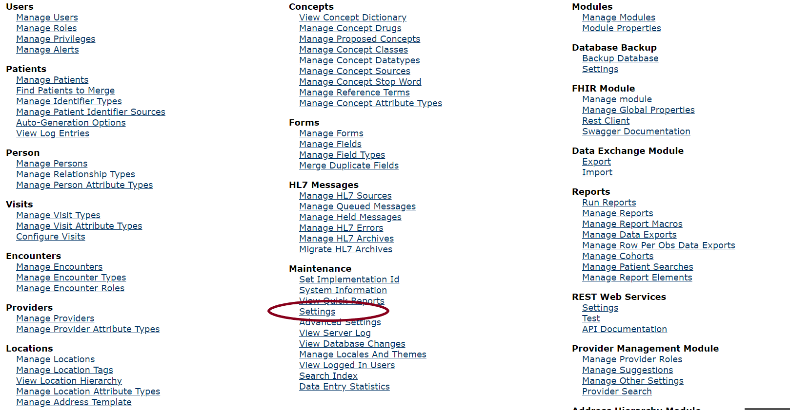
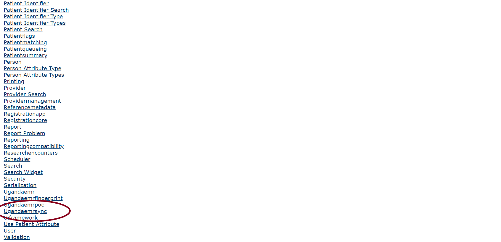
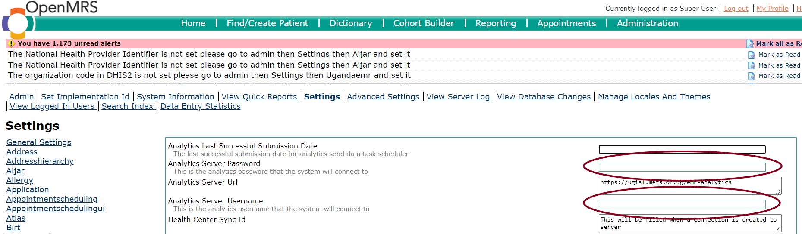
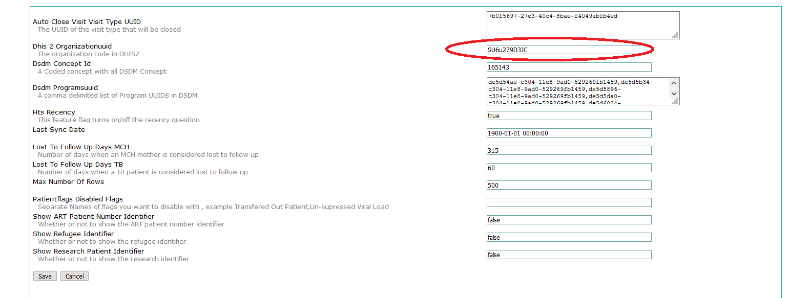

## Submit Usage Analytics Report

### Overview

The analytics usage report is a monthly report  that is submitted to understand the utilization and usage of UgandaEMR across health facilities to provide data to drive adoption. 
This report provides a starting point to help support upgrades, and will replace EMR rollout data calls as the data is submitted on a regular basis
### Configurations

Sending Metrics Report is an automated task in UgandaEMR, however it requires setting some facility Credentials ie. Analytics Username and Password and DHIS2 Facility UUID

To set the Analytics User name and password,

1. Got to Legacy System Administration-&gt;Mantainance-&gt;Settings-&gt;UgandaemrSync.

2. Click Settings
    > 
    
3. Select Ugandaemrsync
    > 
       
4. Set both Analytics Username and Password as your DHIS2 UUID and save.
    > 
    
5. To set the DHIS2 Facility UUID, Got to Legacy System Administration-&gt;Mantainance-&gt;Settings-&gt;Ugandaemr.

   > 
   
6. Set the DHIS2 UUID and save. Now the system is ready send Analytics report whenever internet is available
