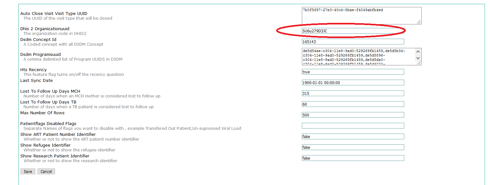

# Sending Report to DHIS2

## Configurations

In order to send data to DHIS2 you need to set a username and password. This can be done in the following steps

1. Got to Legacy System Administration-&gt;Mantainance-&gt;Settings-&gt;Ugandaemr.

   > 

2. Set the DHIS2 Server URL, username and password by:
3. Got to Legacy System Administration-&gt;Mantainance-&gt;Settings-&gt;Ugandaemrsync
4. Save the Above settings

## Sending Data to DHIS2

1. [Generate report](ugandaemr_reports.md#Running%20a%20Report) by following steps 1 to 4. this will generate a report. 
2. Click the _"SendToDHIS2"_ action on the report generated on the reports page. This will popup a report preview all indicators. 
3. On the Preview window, confirm the values displayed and Click the _"SendToDHIS2"_ button. Wait for the Response message which reads _"Data Sent Succesfully"_ or an error message with reason why it was not sent.  **Note:** Pay attention to the response. It may include the following results.

   ```text
    Imported: Number of indicators that have been newly added.
    Updated:  Number of indicators that have been changed 
    Ignored:  Number of indicators that have been ignored.
    Ignored:  Number of indicators that have been deleted.
   ```

4. When the report is not sent due to internet connection issues, you can try sening the report again by repeating step 2 and 3.

## [Trouble shooting tips](report_trouble_shooting.md#Sending%20to%20DHIS2%20Failures)

