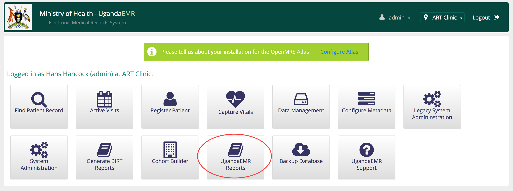
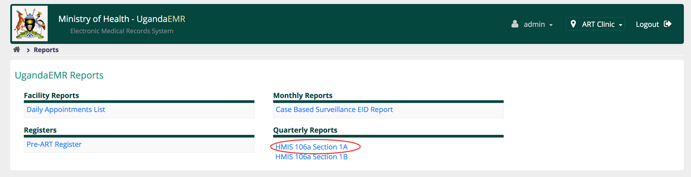
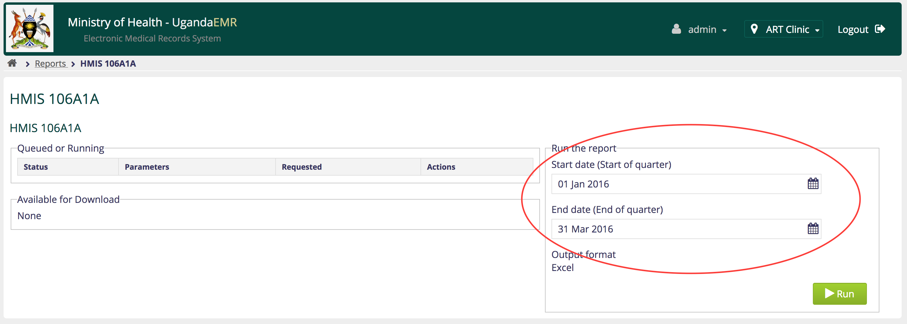
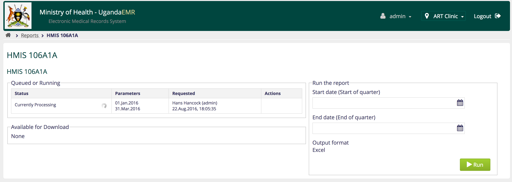
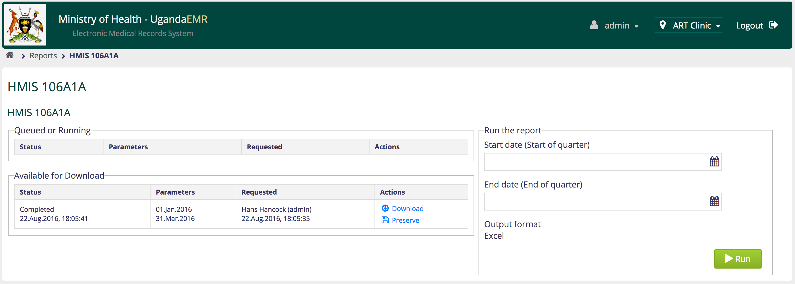

# UgandaEMR Reports

## Reports Dashboard

The dashboard shows the avialable reports in the different categories:

1. Facility Reports - reports that support the running of a facility 
   * Appointments List
   * Missed Appointments List
   * ART Patient Export
   * Facility Death List
   * Exposed Infants Due for 1st PCR
   * Exposed Infants Due for 2nd PCR
   * Exposed Infants Due for Rapid Test
   * Exposed Infants Due for Appointment
   * OptionB+ Weekly SMS Report
   * Transfer Out List
   * Transfer In List
   * Lost Clients
   * Lost To Follow Up
   * Active Patients in Care
   * Due For Viral Load
   * Overdue for Viral Load
   * Stablity Assessment Report
2. Monthly Reports - HMIS reports that are run every month 
   * Case Based Surveillance EID Report
   * Adherence Report
   * Early Warning Indicator Report
   * HMIS 105 - 1: OPD
   * HMIS 105 Section 2.1 to 2.7: MCH
   * HMIS 105 Section 2.8 to 2.12: MCH - Child Services
   * HMIS 105 - 3 to 4: Outreach and HCT
   * HMIS 105 Section 5: SMC
   * HCA Annual Report
   * HCA 12 and 24 Months Report
3. Quarterly Reports - HMIS reports that are run every quarter
   * HMIS 106a Section 1A
   * HMIS 106a Section 1B
   * CBS Adult Quarterly Report
   * HMIS 177 Viral Load Addendum Quarterly Report
   * HMIS 106a With DSDM Aggregations
4. Registers - match the HMIS registers for different data collection forms 
   * HMIS 031: OPD Register
   * HMIS 035: SMC Register
   * HMIS 053: Patient Appointment Book
   * HMIS 055 : HCT Register
   * HMIS 071: ANC Register
   * HMIS 072: Maternity Register
   * HMIS 078: PNC Register
   * HMIS 080: Pre-ART Register
   * HMIS 081: ART Register
   * HMIS 082: EID Register
   * HMIS 096a: TB Register
5. MER Indicator Reports
   * HTS\_RECENT Report
   * HCT\_TST\_Facility Report
   * Tx Current\_28Days Report
   * Tx Current\_90Days Report
   * Tx New Report
   * TB STAT Report
   * TB ART Report
   * PMTCT STAT Report
   * PMTCT ART Report
6. Early Warning Indicator Reports - run annually 
   * Lost To Follow Up
   * Pill Pickup
   * Viral Load Supression
7. Integration Data Exports 
   * Family Connect EMTCT Module Data Export - for data import into EMTCT module of Family Connect 

## Running a Report

1. Login as a user with privileges to access the reports
2. Click the UgandaEMR reports link as in the image below

   

3. On the Reports dashboard click the link to 106A Section 1A

   

4. Enter the start date and end date for the quarter you wish to generate the report, then click the Run button

   

5. This report will run for a while as shown by the progress icon 

   

6. Once the report is generated there are two options:
   * Download - downloads the generated report in Excel
   * Preserve - saves the data for the generated report, which will not change when data is updated or corrected later in the future 

