## BIRT Reporting Module 
The BIRT module provides a number of pre-built reports that are used to provide facility level metrics as well as MoH HMIS reports

**Before starting to use birt reporting make sure that the birt module is running**

To check that module is running
1. Select legacy ui on home

2. You will see the birt reporting section on the administration page

If the Birt reporting does not appear on the administration page, it means that the birt module is not started
If the module is not started, try to start it

If the module is not administration module's page, that means the module is not installed, please refer to birt module installation instructions section

If the module fails to start refer to configuration section

Click on the error detail to see the details of the error

### Installation
**What you will need**
* Birt module version 2.3.2.1
* Birt report engine vs 2.3_2 (birt.home)
* You also need to create the following directories (will be used in the birt configuration)
  * Directory the will hold data sets (birt.datasetDir)
  * Directory where birt logs will dumped (birt.loggingDir)
  * Directory where generated output will be stored (birt.outputDir)
  * Directory where report designs will be stored (birt.reportDir)

Then
1. Go to manage modules on the legacy administration ui and then add or update module

2. Click choose and then browse where the birt omod file is located
3. Click upload, this will upload and try to start the birt module which will fail. Refer to the configuration section to configure birt

Error page

### Configurations
To configure birt,
1. Go to legacy ui administration page, then click on advanced settings

2. Look for birt related configurations and change them accordingly (based on the directories you created above)

3. After configuring birt accordingly, start birt again

**To add run or edit reports make go to home and then click generate birt reports**
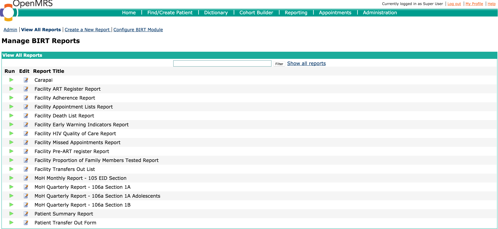
If you get this page, means that birt is not running refer to the above on making sure that birt reports run

### Adding reports
1. Click add new report in the main birt reports main page
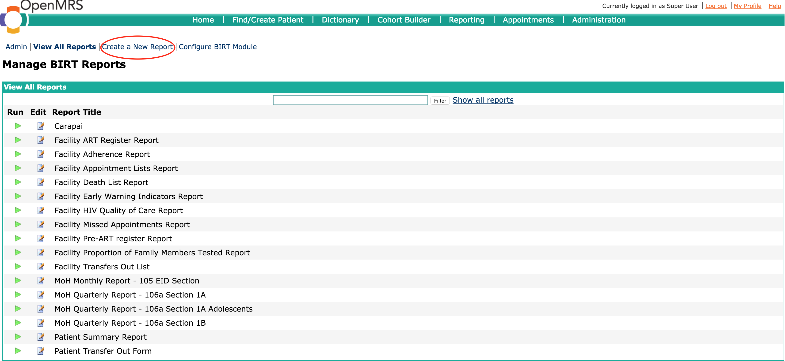
2. The form for entering new report appears which you then fill and click save. This brings another page for adding the report design
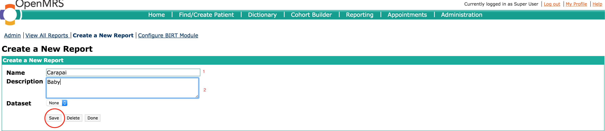
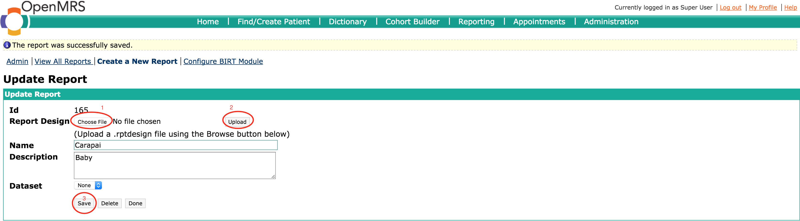
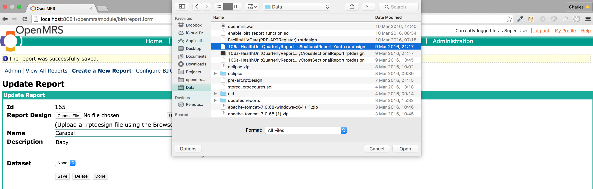
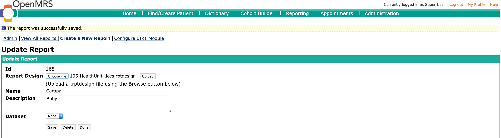
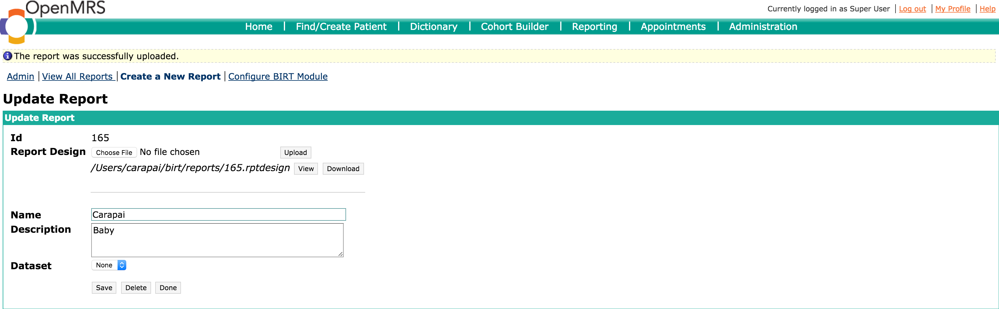

### Editing and deleting reports
1. To edit or delete a report go to birt home and click the edit button, This create report, but which allows you to edit or delete
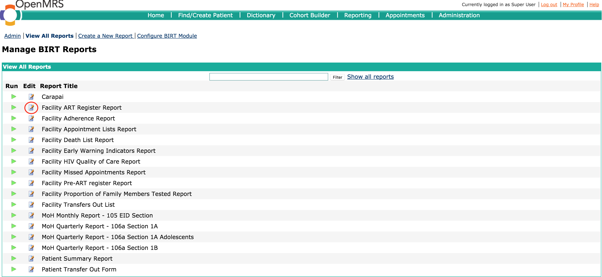

### Running reports
1. To run reports you click the run button
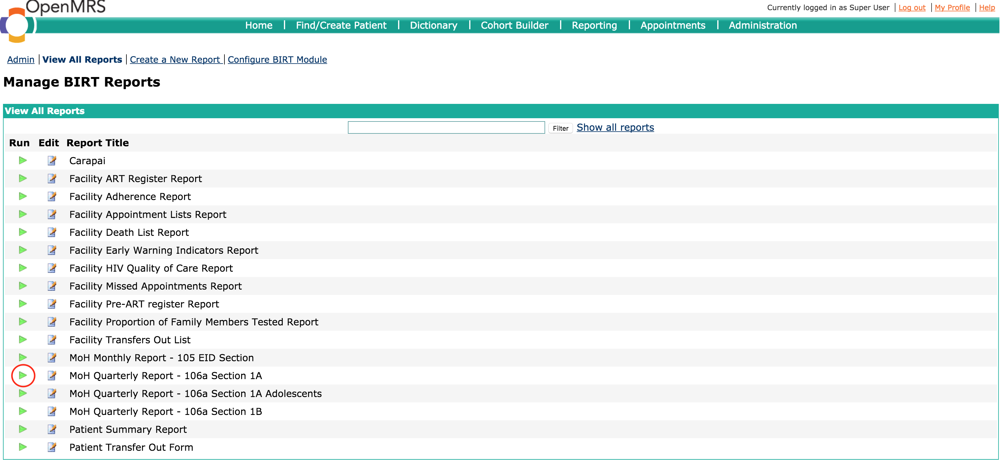
2. This take you a page where you can input any parameters if required
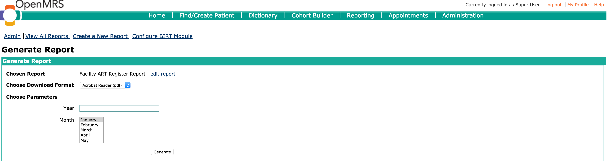
3. You can also choose how you want the report to be rendered
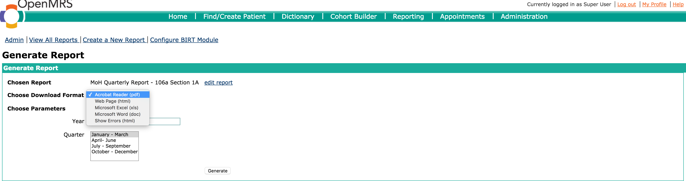
4. You then click generate to run, display,download the report
