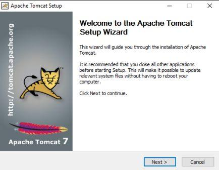
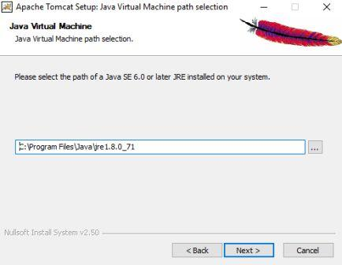
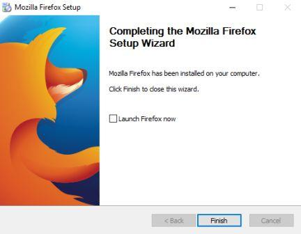

# Setup and Configuration
## Prerequisites
### Minimum Computer Requirements

1. Windows 7 (both 32-bit and 64-bit versions supported)
2. 4GB of RAM
3. 1.5GHz duo core processor

### Recommended Minimum Software Requirements
1. Java 7 (do not use Java 8)
2. Tomcat 7
3. MySQL 5.5
4. Mozilla Firefox 44

## Manual Setup 
### Requirements for Manual Installation
This process will be added at a later stage, as currently the automatic installation is the easiest way to get the required configuration

## Interactive Setup via installer
The installer provides all the prerequisite components for setting up UgandaEMR, parts of this guide have been adopted from the World Health Organization (WHO) OpenMRS Express guide.

There are separate installation files for 32-bit and 64-bit Windows systems so pick the installation package.

### Installation Directories and Menu Items
The installer creates the following directory structure:

* **Main Directory** - C:\Program Files\UgandaEMR
* **Tomcat Directory** - C:\Program Files\UgandaEMR\UgandaEMRTomcat
* **Mysql Directory** - C:\Program Files\MySQL\MySQL Server 5.5 *TODO: Correct this*
* **OpenMRS Configuration Files** - C:\ApplicationData\OpenMRS *TODO: Correct this*

The following items are also added to the Windows Start Menu:
* **TODO: Add Start Menu Items**

A shortcut link to the UgandaEMR instance is also added to the Desktop **TODO: Add screenshot of desktop with the Shortcut link**

### Installation Overview

### Installation Steps
1. Launch of the splash screen
  

2. License Agreement
  

3. Selecting components to install

4. Determining Installation directory

5. Confirm start menu item

6. Install Java Runtime

7. Install MySQL  
  

8. Install Tomcat  

 

9. Install Firefox

 10. UgandaEMR Installation completed

### Post-installation Configuration
**TODO: Work on this section**