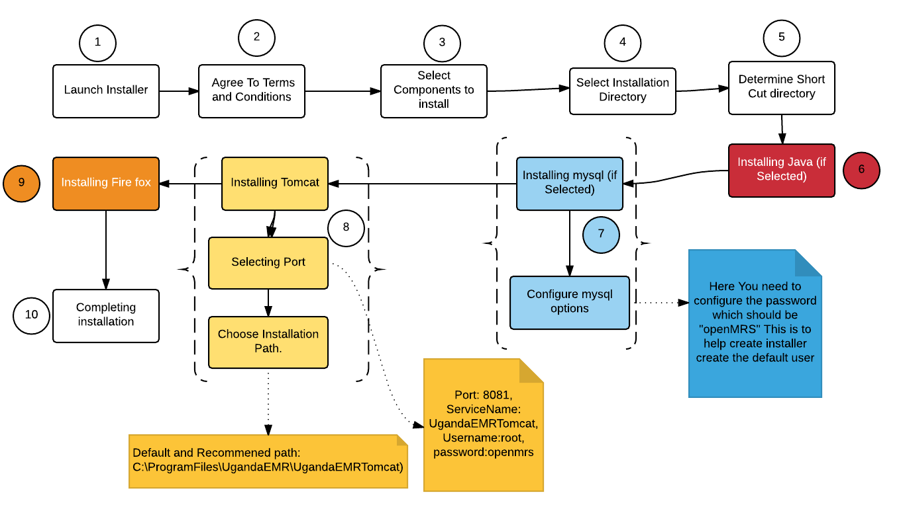

# System Setup and Configuration

## Prerequisites

### Minimum Computer Requirements

1. Windows 7 \(both 32-bit and 64-bit versions supported\)
2. 4GB of RAM
3. 1.5GHz duo core processor

### Recommended Minimum Software Requirements

1. Java 8 for UgandaEMR 2.0.0 and above \(Java 7 for UgandaEMR 1.x - not recommended\)
2. Tomcat 7
3. MySQL 5.5
4. Mozilla Firefox 44

## Manual Setup

### Requirements for Manual Installation

This process will be added at a later stage, as currently the automatic installation is the easiest way to get the required configuration

## Interactive Setup via installer

The installer provides all the prerequisite components for setting up UgandaEMR, parts of this guide have been adopted from the World Health Organization \(WHO\) OpenMRS Express guide.

There are separate installation files for 32-bit and 64-bit Windows systems so pick the most suitable installation package.

### Installation Directories and Menu Items

The installer creates the following directory structure:

1. **Main Directory** - C:\Program Files\UgandaEMR
2. **Tomcat Directory** - C:\Program Files\UgandaEMR\UgandaEMRTomcat
3. **Mysql Directory** - C:\Program Files\MySQL\MySQL Server 5.5 _TODO: Correct this_
4. **OpenMRS Configuration Files** - C:\ApplicationData\OpenMRS _TODO: Correct this_

The following items are also added to the Windows Start Menu:  
1. **TODO: Add Start Menu Items**

A shortcut link to the UgandaEMR instance is also added to the Desktop   
**1.** TODO: Add screenshot of desktop with the Shortcut link\*\*

### Installation Overview

### Installation Steps

Follow the steps below for the relevant installation process:

1. [UgandaEMR 1.x Installation Steps](ugandaemr-1x-installation.md) 
2. [UgandaEMR 2.x Installation Steps](ugandaemr-2x-installation.md)
3. [Post-installation Configuration](post-installation-configuration.md)

