# UgandaEMR 1.x Installation

1. Launch of the splash screen

1. License Agreement

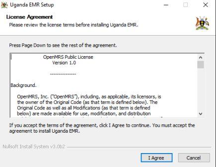

1. Selecting components to install 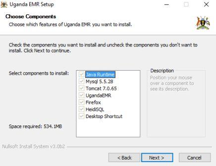
2. Determining Installation directory

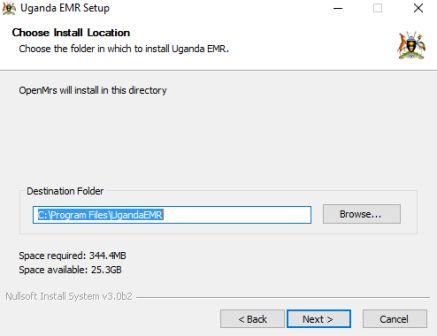

1. Confirm start menu item 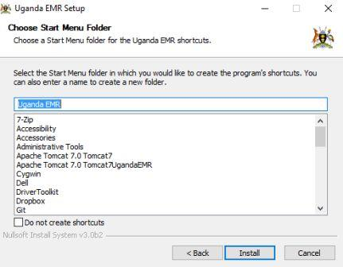
2. Install Java Runtime 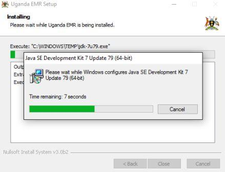  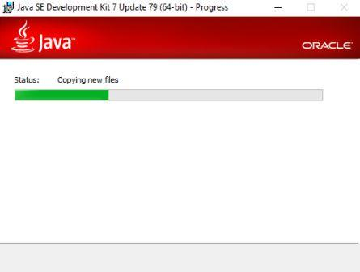 

7.Install MySQL  
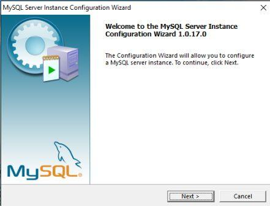  
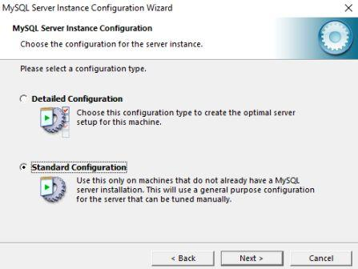  
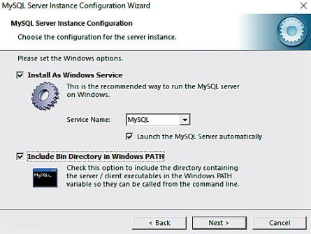  
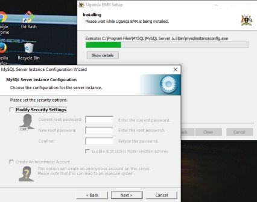  
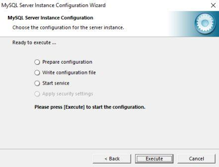  
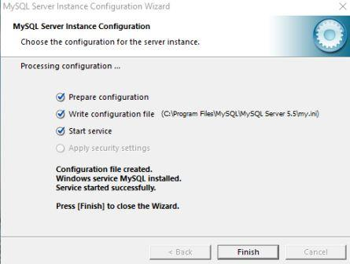

8.Install Tomcat  

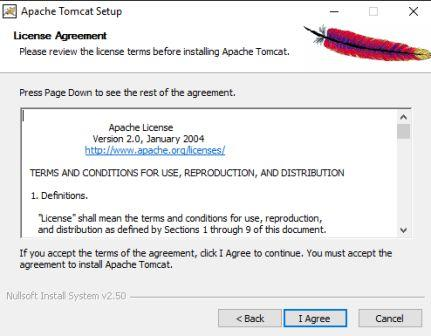

 **NOTE: DO NOT CHNAGE THE Java Virtual Machine path PATH** 

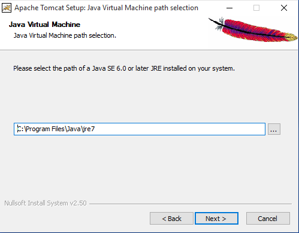

The following changes need to be made:

* HTTP/1.1 Connector port - 8081
* Windows Service Name - UgandaEMRTomcat
* Tomcat administrator login username: root 
* Tomcat administrator login password: openmrs

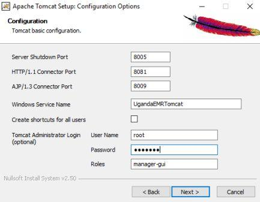

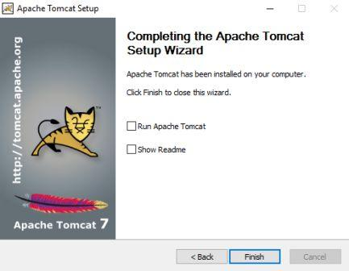

9.Install Firefox  
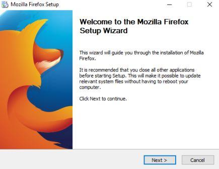  
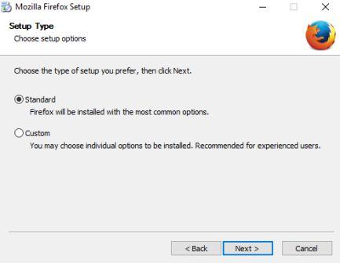  
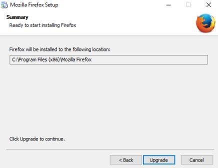  
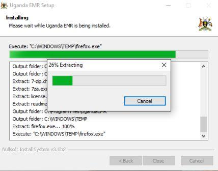

10.Installing HeidiSQL  
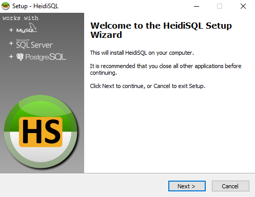

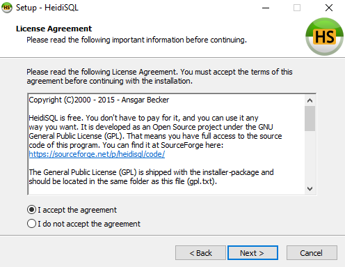  
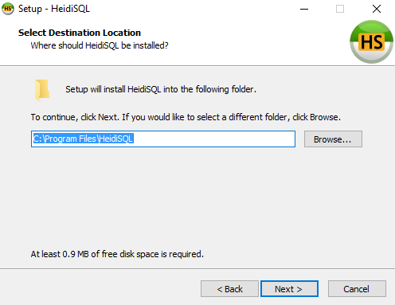  
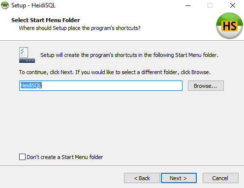  
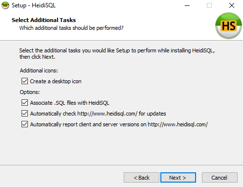  
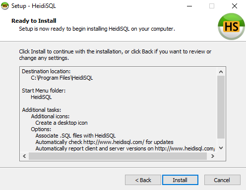

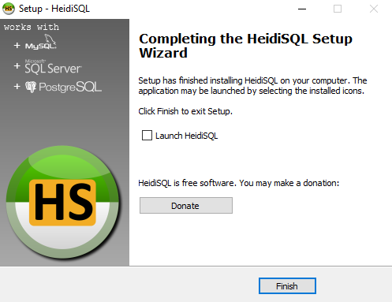

11.UgandaEMR Installation completed  
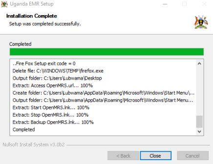

