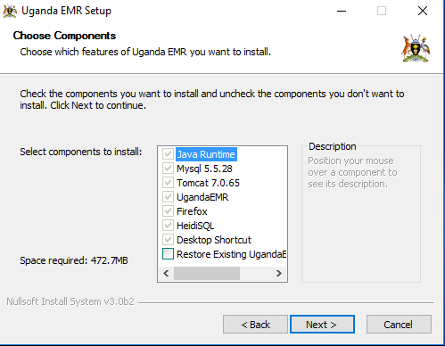
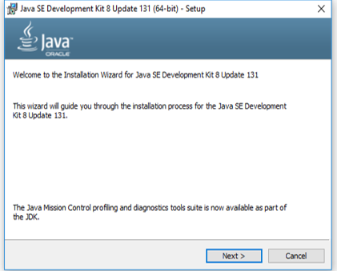
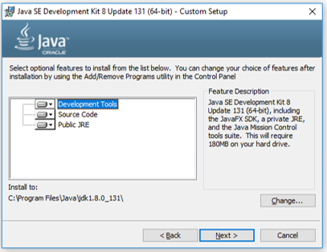
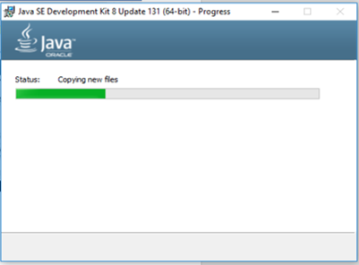
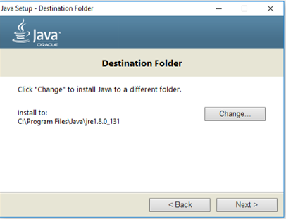
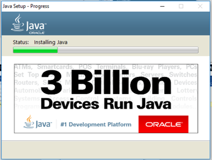
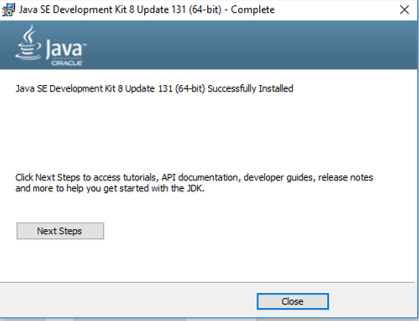
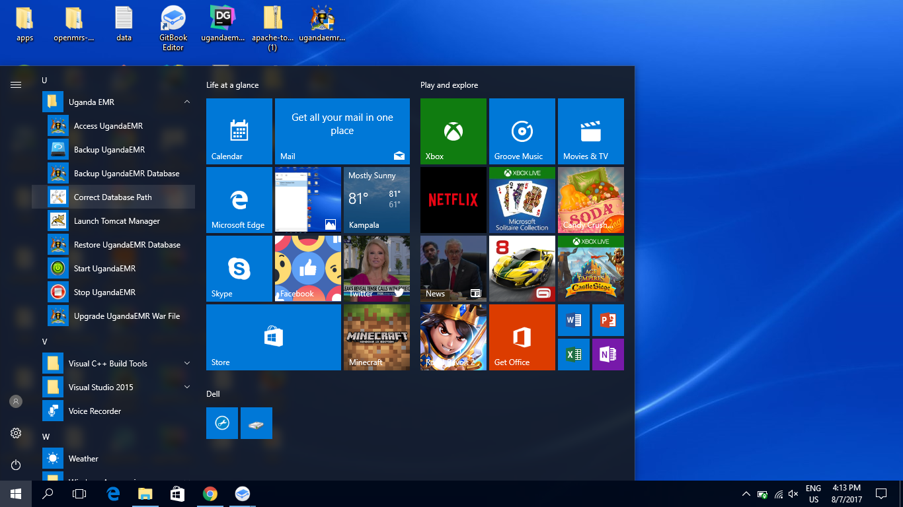

# UgandaEMR 2.x Installation

1. Launch of the splash screen


1. License Agreement


1. Selecting components to install. Select Restore Existing UgandaEMR database if you have any data backed up from any older version of UgandaEMR


1. Determining Installation directory


1. 
2. Confirm start menu item 
3. Install Java Runtime














7.Install MySQL  
  
  
  
  
  


8.Install Tomcat  
This is a silent process in the background

9.Install Firefox  
  
  
  


10.Installing HeidiSQL  


  
  
  
  


11.UgandaEMR Installation completed  


## Troubleshooting Guide

### OpenMRS Installation Wizard Appears

Incase the screen below appears, 

To fix this:

1. Go to the start menu
2. Select UgandaEMR and select **Connect Database Path** and let it run and correct the path

  
3. Restart your computer  
4. Start UgandaEMR using the Desktop shortcut

### Error occurs starting a large number due to metadamapping index creation issue

An error similar to the one below is shown in the log files:

```text
WARN - ModuleFactory.startModuleInternal(788) |2018-03-22 16:58:39,213| Error while trying to start module: metadatamapping
org.openmrs.module.ModuleException: Unable to update data model using liquibase.xml. Module: Metadata Mapping
    at org.openmrs.module.ModuleFactory.runLiquibase(ModuleFactory.java:1034)
    at org.openmrs.module.ModuleFactory.startModuleInternal(ModuleFactory.java:728)
    at org.openmrs.api.context.Daemon$1.run(Daemon.java:74)
Caused by: liquibase.exception.MigrationFailedException: Migration failed for change set liquibase.xml::metadatamapping-2016-02-07-1310-b-mysql::kosmik:
     Reason: liquibase.exception.DatabaseException: Error executing SQL create index metadatamapping_idx_mdtm_mdclass on metadatamapping_metadata_term_mapping(metadata_class(255)): Duplicate key name 'metadatamapping_idx_mdtm_mdclass':
          Caused By: Error executing SQL create index metadatamapping_idx_mdtm_mdclass on metadatamapping_metadata_term_mapping(metadata_class(255)): Duplicate key name 'metadatamapping_idx_mdtm_mdclass':
          Caused By: Duplicate key name 'metadatamapping_idx_mdtm_mdclass'
```

**Fix:** Run the following SQL statement on the openmrs database then restart your computer

```text
DROP index metadatamapping_idx_mdtm_mdclass ON metadatamapping_metadata_term_mapping;
```

### MySQL Database Service keeps failing after an upgrade from UgandaEMR 1.x


During the upgrade process, a configuration file is copied which may cause the system to crash due to a conflict in the sizes of the MySQL log files before upgrade and after upgrade. The steps below are to remove the log files causing the conflict

1. Open Services console and stop the UgandaEMR MySQL service 
2. Using windows explorer navigate to the MySQL folder, either _C:\Program Files\MySQL\Data_ or _C:\Program Files\MySQL 5.5\Data_
3. Delete the files named idblog 
4. Restart your computer 

The connection error should be resolved.

### UgandaEMR Reports module does not start on upgrade to 2.0

There are two issues that have been identified that cause this:

* The maximum packet size for the MySQL server is too small so needs to be increased to 16M
* The serialized column where the Excel template is stored does not allow the special characters to be saved.

The fix is therefore a 2 step process:

1. Increase the maximum packet size for the MySQL server:
   * Open Notepad as an administrator - this is because the configuration file being edited in located in the C:\Program Files folder which has restrictions on who can edit the files. 
   * Open the file my.cnf \(or my in case Windows Explorer is configured to hide the extensions for files\)
     * Search for the variable max\_allowed\_packet and change is value to 16M
     * If the variable does not exists add it following the steps below:
     * Search for the section \[mysqld\]
     * Add max\_allowed\_packet=16M
   * Save the file
   * Restart your computer
   * Run the following on the command prompt `mysql -u openmrs -p -e "SHOW GLOBAL VARIABLES LIKE 'max_allowed_packet'"` which will show 16777216 which means the variable has been changed
2. Fix the character set of the serialized column by running the following SQL statement on the openmrs database:

   ```text
   ALTER TABLE `serialized_object` MODIFY `serialized_data` MEDIUMTEXT CHARACTER SET utf8 NOT NULL;
   ```

3. Restart your computer

## UgandaEMR Tomcat Service fails to start after re-installing UgandaEMR


This issue has been identified to be caused by the Improper un-installation process of UgandaEMR.

This is normally done by deleting of the the UgandaEMR Folder in the C:\Program Files folder which is not recommended.

The recommended un-installation process can be found [here](../uninstalling-ugandaemr/unistallinstalling-ugandaemr-older-versions.md).

To fix this issue.

* Uninstall the UgandaEMR  you have just installed  in the recommended way 
* Open the command prompt as an Administrator by searching Command prompt in the windows task bar , and then press Ctrl+Shift+Enter
* On your command prompt, type "sc delete UgandaEMRTomcat " without quotes and press enter.
* If it shows no error, restart your computer and install UgandaEMR freshly as recommended [here.](ugandaemr-2x-installation.md)

