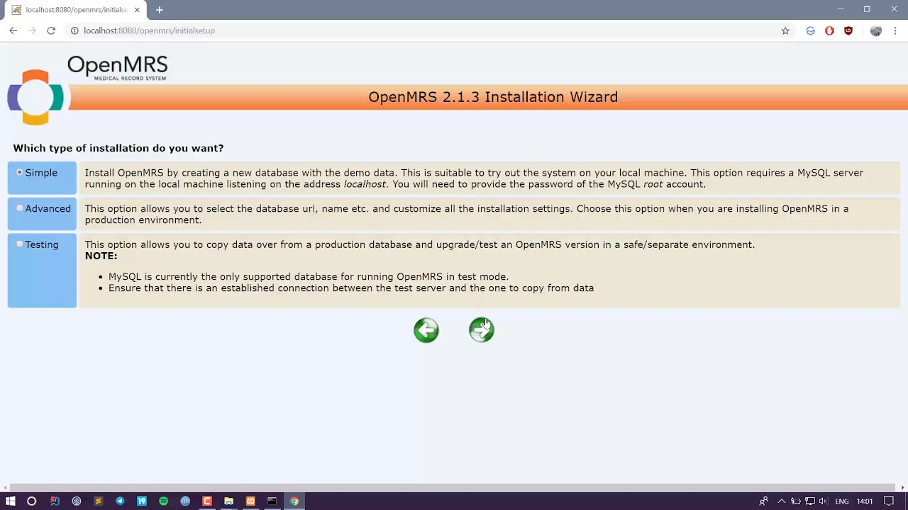

# UgandaEMR Linux Installation

## Software Requirements for UgandaEMR

    - Java JDK 8 
    - Tomcat 7 or higher
    - Mysql 5.6 or 5.7

## Installation of Java

1. Login as root in the linux environment
2. Download the JDK 8(jdk-8u361-linux-x64.tar.gz) from this official
   site:
3. Open the terminal and enter the following command to create the parent directory to deploy the JDK.  
   <code> sudo mkdir /usr/lib/jvm </code>
4. Enter the following command to change the directory
   <code> cd /usr/lib/jvm</code>
5. Extract the jdk-8u361-linux-x64.tar.gz file in the jvm directory using this command

   <code>sudo tar -xvzf /YourHomeDirectory/jdk-8u361-linux-x64.tar.gz</code>
6. Enter the following command to open the environment variables file. According to your personal preference, you can
   choose any text editor instead of nano.
   <code>sudo nano /etc/environment </code>
7. In the opened file, add the following bin folders to the existing PATH variable. Note that the PATH variables must be
   separated by a colon.

   `/usr/lib/jvm/jdk1.8.0_361/bin`

   `/usr/lib/jvm/jdk1.8.0_361/db/bin`

   `/usr/lib/jvm/jdk1.8.0_361/jre/bin`

    Append the following environment variable to the end of the file.
    
       `J2SDKDIR="/usr/lib/jvm/jdk1.8.0_361" `
    
       `J2REDIR="/usr/lib/jvm/jdk1.8.0_361/jre"`
    
       `JAVA_HOME="/usr/lib/jvm/jdk1.8.0_361"`
    
    A sample environment file before making these changes would look like the following:
       
        PATH="/usr/local/sbin:/usr/local/bin:/usr/sbin:/usr/bin:/sbin:/bin:/usr/games:/usr/local/games"
    
    The same file after making the changes should look like this:

       PATH="/usr/local/sbin:/usr/local/bin:/usr/sbin:/usr/bin:/sbin:/bin:/usr/games:/usr/local/games:
       /usr/lib/jvm/jdk1.8.0_361/bin:/usr/lib/jvm/jdk1.8.0_361/db/bin:/usr/lib/jvm/jdk1.8.0_361/jre/bin"
       
       J2SDKDIR="/usr/lib/jvm/jdk1.8.0_361"
       
       J2REDIR="/usr/lib/jvm/jdk1.8.0_361/jre"
       
       JAVA_HOME="/usr/lib/jvm/jdk1.8.0_361"

8. Save the changes and close the editor

9. Sometimes an existing JDK installation might have a shortcut added to the /usr/bin directory. Therefore setting the
   PATH environment variable alone may not change the default Java compiler and runtime. To update these alternative
   shortcuts, run the following commands:
   <code>

   sudo update-alternatives --install "/usr/bin/java" "java" "/usr/lib/jvm/jdk1.8.0_351/bin/java" 0

   sudo update-alternatives --install "/usr/bin/javac" "javac" "/usr/lib/jvm/jdk1.8.0_351/bin/javac" 0

   sudo update-alternatives --set java /usr/lib/jvm/jdk1.8.0_351/bin/java

   sudo update-alternatives --set javac /usr/lib/jvm/jdk1.8.0_351/bin/javac
   </code>
10. To verify the setup enter the following commands and make sure that they print the location of java and javac as you
    have provided in the previous step.

    <code>update-alternatives --list java</code>

    <code>update-alternatives --list javac</code>
11. Test version on terminal with command
12. <code>java -version</code>
13. If you are not able to see the version install missing linux libraries
    
    <code> sudo apt-get install libc6-i386</code>

## Installation of Tomcat

Tomcat installation will require java which were previously installed as shown above

1. <code> sudo apt update</code>
2. Set up a Tomcat user  <code>sudo useradd -r -m -U -d /opt/tomcat -s /bin/false tomcat</code>
3. Download tomcat 
<code> wget -c https://archive.apache.org/dist/tomcat/tomcat-7/v7.0.109/bin/apache-tomcat-7.0.109.tar.gz </code>
4. Install on linux
   <code> sudo tar xf apache-tomcat-7.0.109.tar.gz -C /opt </code>
5. Rename apache-tomcat-7.0.109 to tomcat

   `cd /opt `

   `mv apache-tomcat-7.0.109 tomcat`
   
6. Now we need to provide the user Tomcat with access for the Tomcat installation directory
   
   <code>sudo chown -R tomcat: /opt/tomcat/* </code>
7. Finally, we will use the chmod command to provide all executable flags to all scripts within the bin directory.

   <code>sudo sh -c 'chmod +x /opt/tomcat/bin/*.sh' </code>
8. Configure Tomcat serice
   <code> 
   sudo nano /etc/systemd/system/tomcat.service
   </code>
   
    Now enter the following in your file and save it. Note that you need to update the value of JAVA_HOME if your Java installation directory is not the same as given below.

    [Unit]
    Description=Apache Tomcat Web Application Container
    After=network.target
   
    [Service]
    Type=forking
      
    Environment="JAVA_HOME=/usr/lib/jvm/jdk1.8.0_361"
    Environment="CATALINA_PID=/opt/tomcat/temp/tomcat.pid"
    Environment="CATALINA_HOME=/opt/tomcat/"
    Environment="CATALINA_BASE=/opt/tomcat/"
    Environment="CATALINA_OPTS=-Xms1024M -Xmx2048M -server -XX:+UseParallelGC"
    Environment="JAVA_OPTS=-Djava.awt.headless=true -Djava.security.egd=file:/dev/./urandom"
      
    ExecStart=/opt/tomcat/bin/startup.sh
    ExecStop=/opt/tomcat/bin/shutdown.sh
      
    User=tomcat
    Group=tomcat
    UMask=0007
    RestartSec=10
    Restart=always
      
    [Install]
    WantedBy=multi-user.target

9. Now we reload the daemon to update the system about the new file.
   <code>sudo systemctl daemon-reload</code>
10. Start tomcat service  <code>sudo systemctl start tomcat</code>
10. Now we can enable the Tomcat service to run on startup using this command.
    <code>sudo systemctl enable tomcat </code>
11. After you install Tomcat, you need to allow it to use the 8080 port through the firewall to be able to
    communicate outside your local network.
    <code> sudo ufw allow 8080/tcp </code>
12. Once we install Tomcat on Linux, we need to verify our installation. To do so, simply enter the following in your
    browser.
13. <code> http://YourIPAddress:8080  </code>

If your installation and configuration were successful, you should see this page.

14. To enable tomcat to write in /var/lib , create the OpenMRS folder and make tomcat to own it using the commands below
    
    `cd /var/lib`

    `mkdir OpenMRS`

    `sudo chown tomcat:tomcat OpenMRS/*`
    
15. Done.

## Mysql 5.6 Installation

Guide for mysql installation is provided in link here
[Mysql Installation](https://gist.github.com/dbaluku/f7014c2dcc9f184d5628c132282fa834)

Remember to create mysql user  'openmrs'

## Deploying UgandaEMR  on Linux

1. Stop tomcat service
   <code> sudo service tomcat stop </code>
2. copy war file to /opt/tomcat/webapps folder
3. Start tomcat service  <code>  sudo service tomcat start </code>
4. Access the system on browser via <code> http://YourIPAddress:8080/openmrs </code>
5. You should see OpenMRS Installation Wizard page as below
   
6. Select your preferred language and click the “=>” button.
7. On the Installation Type screen, choose the Advanced installation type  you want and click the “=>” button.
   
8. Fill in your MySQL root password as shown below, and click the “=>” button.
   
9. Fill the Next form  as shown below and click the “=>” button.
   
10. Fill in options as shown below and click the “=>” button.
    
11. Fill in admin password as shown below and click the “=>” button.
    
12. Skip next form  click the “=>” button.
13. And continue to finish the installation

14. Drop openmrs database dump  to openmrs database and restart tomcat service.

15. Done
   Click the “=>” button to create a database for OpenMRS and complete the installation.
   Log in to OpenMRS using the default username “admin” and password “Admin123”.

