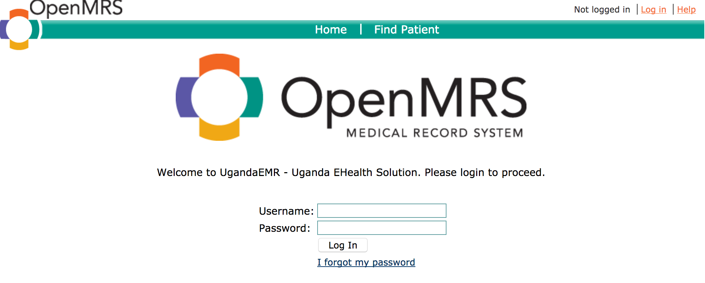
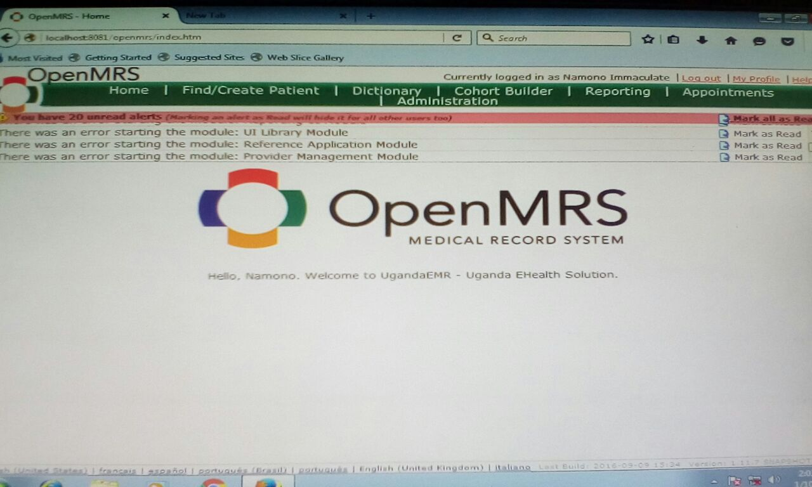
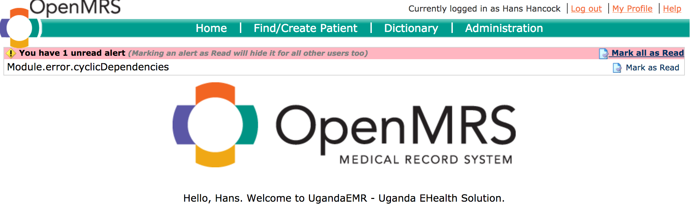
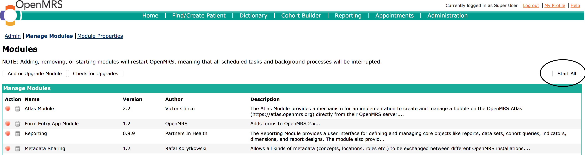
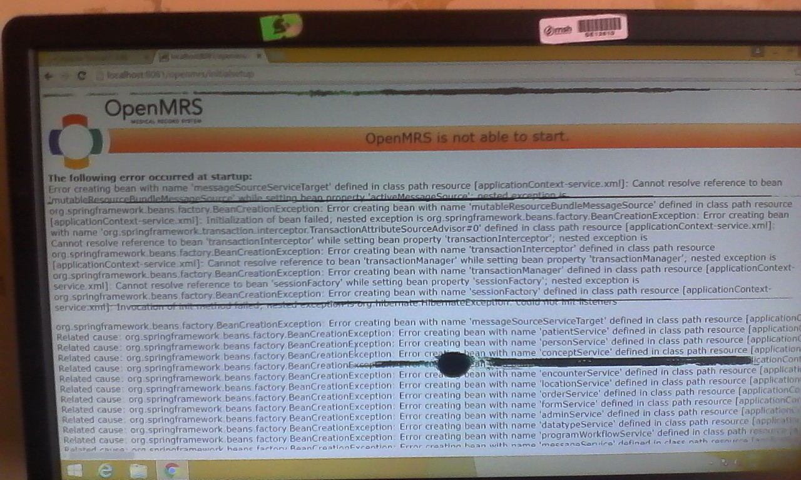

## Troubleshooting Tips

This section contains tips and tricks to help maintain your installation, as well as a general guide to common problems 

### My installation cannot start 
Restart your computer

### UgandaEMR login screen not available yet system starts
**Error Messages and Screenshots ** 

When you login the screen may display as below:

**Resolution**

1. On the Administration page, select the Manage Modules link

2. Click the Start All button 

3. Restart your computer 

### OpenMRS cannot start - Error creating bean with name "messageSourceServiceTarget"

**Error Messages and Screenshots**

 

** Resolution ** 

1. Delete the folder C:\Application Data\OpenMRS\lucene
2. Restart your computer 

### White screen appears when carrying out administrative tasks like module installation, upgrade 