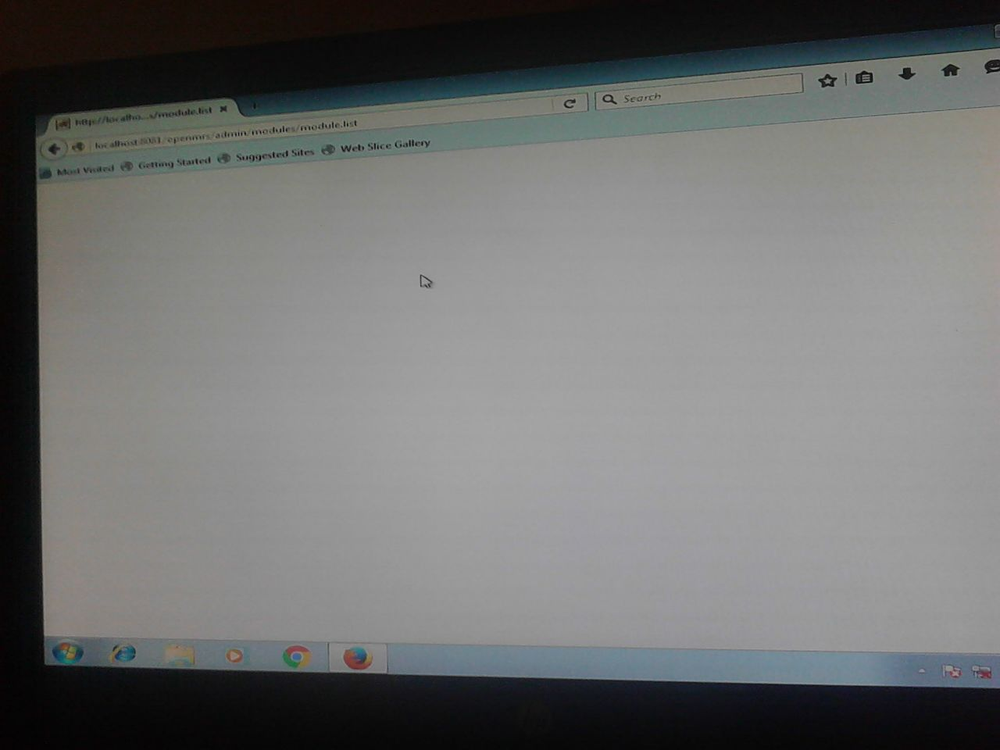

## Troubleshooting Tips

This section contains tips and tricks to help maintain your installation, as well as a general guide to common problems

### My installation cannot start

Restart your computer

### UgandaEMR login screen not available yet system starts

**Error Messages and Screenshots **  


When you login the screen may display as below:


**Resolution**

1. On the Administration page, select the Manage Modules link
   
2. Click the Start All button 
   
3. Restart your computer 

### OpenMRS cannot start - Error creating bean with name "messageSourceServiceTarget"

**Error Messages and Screenshots**


** Resolution **

1. Delete the folder C:\Application Data\OpenMRS\lucene
2. Restart your computer 

### White screen appears when carrying out administrative tasks like module installation, upgrade

** Error messages and Screenshots **  


** Resolution **

Restart your computer and repeat the action that caused the error

### Cohort Builder does not  Allow defining of Columns

**Screen Shots **


##### Root Cause

The main root cause of this problem is due to  the addition of other  programs into the UgandaEMR system by an individual\( which is prohibited \)  that leads to creation of concepts and thereby resulting into concept mismatch with concepts that come with UgandaEMR.


##### Resolution

1. Download the concept dictionary from the source [https://sourceforge.net/projects/ugandaemr/files/1.0.13/concept\_dictonary\_ref\_1.0.13.sql/download](https://sourceforge.net/projects/ugandaemr/files/1.0.13/concept_dictonary_ref_1.0.13.sql/download)
2. Open your command Prompt and login to mysql  with the following command without quotes  "mysql -u openmrs -p" and provide it with the required password 
3. Run the concept dictionary downloaded on your database on the command prompt
4. After the concept dictionary is done, run the following script on the same command prompt

```
/*!40101 SET @OLD_CHARACTER_SET_CLIENT = @@CHARACTER_SET_CLIENT */;
/*!40101 SET @OLD_CHARACTER_SET_RESULTS = @@CHARACTER_SET_RESULTS */;
/*!40101 SET @OLD_COLLATION_CONNECTION = @@COLLATION_CONNECTION */;
/*!40101 SET NAMES utf8 */;
/*!40103 SET @OLD_TIME_ZONE = @@TIME_ZONE */;
/*!40103 SET TIME_ZONE = '+00:00' */;
/*!40014 SET @OLD_UNIQUE_CHECKS = @@UNIQUE_CHECKS, UNIQUE_CHECKS = 0 */;
/*!40014 SET @OLD_FOREIGN_KEY_CHECKS = @@FOREIGN_KEY_CHECKS, FOREIGN_KEY_CHECKS = 0 */;
/*!40101 SET @OLD_SQL_MODE = @@SQL_MODE, SQL_MODE = 'NO_AUTO_VALUE_ON_ZERO' */;
/*!40111 SET @OLD_SQL_NOTES = @@SQL_NOTES, SQL_NOTES = 0 */;

DELETE from patient_program ;
DELETE from program;

/*!40101 SET SQL_MODE=@OLD_SQL_MODE */;
/*!40014 SET FOREIGN_KEY_CHECKS=@OLD_FOREIGN_KEY_CHECKS */;
/*!40014 SET UNIQUE_CHECKS=@OLD_UNIQUE_CHECKS */;
/*!40101 SET CHARACTER_SET_CLIENT=@OLD_CHARACTER_SET_CLIENT */;
/*!40101 SET CHARACTER_SET_RESULTS=@OLD_CHARACTER_SET_RESULTS */;
/*!40101 SET COLLATION_CONNECTION=@OLD_COLLATION_CONNECTION */;
/*!40111 SET SQL_NOTES=@OLD_SQL_NOTES */;
```

   5. Start your UgandaEMR now in  your browser.


