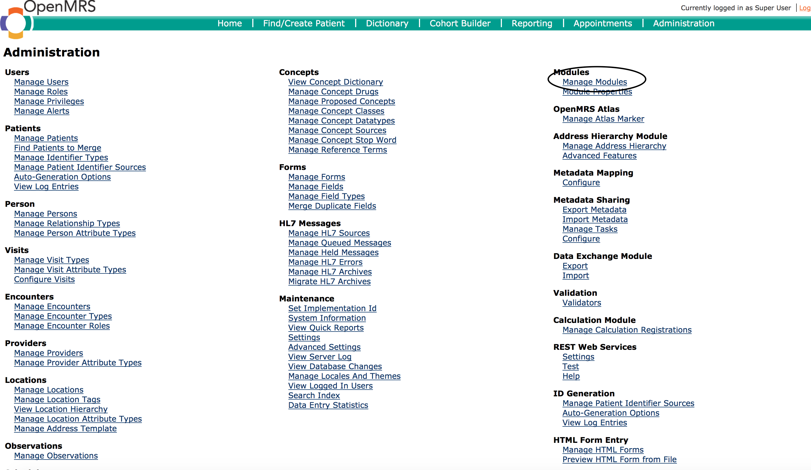

## Troubleshooting Tips

This section contains tips and tricks to help maintain your installation, as well as a general guide to common problems 

### My installation cannot start 
A quick solution is usually to restart your computer

### I cannot access the UgandaEMR look yet I can login 
**Error Messages and Screenshots ** 

When you login the screen may display as below:

**Resolution**

1. On the Administration page, select the Manage Modules link

2. Click the Start All button 

3. Restart your computer 

