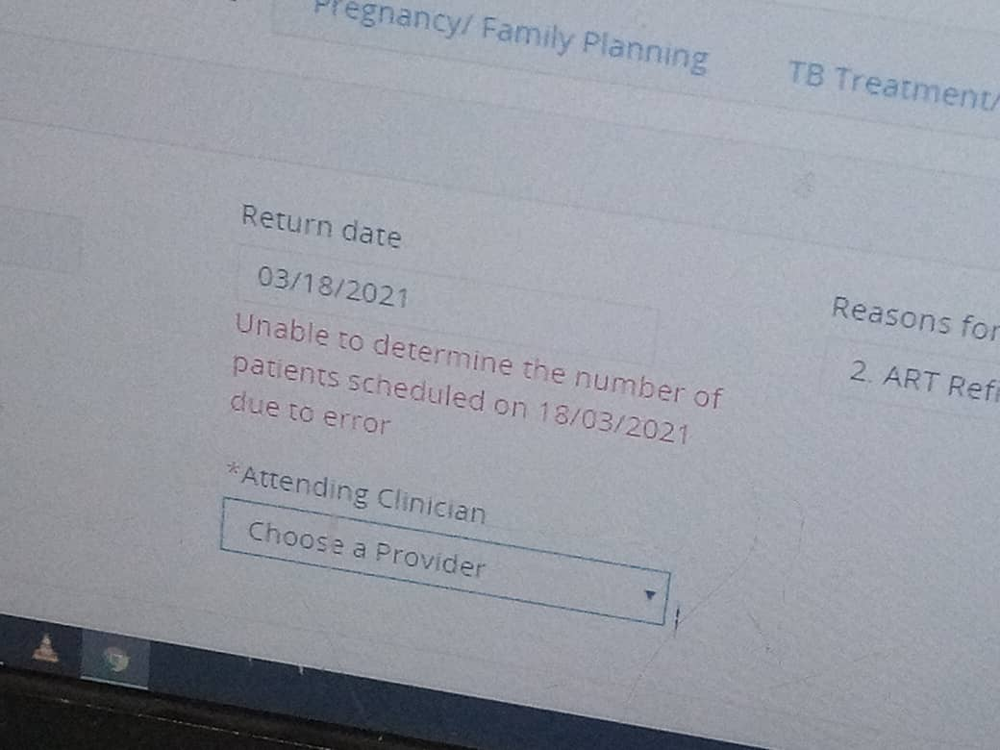

# Common Troubleshooting Tips
This section contains fixes for common errors that occur when using UgandaEMR
## I have created a visit but the encounter has different dates
Delete the encounter then delete the visit and re-enter the encounter 
## Location does not support visits
This error occurs when the user session has expired therefore there is no location selected in the top right hand corners. 

Log out of your account then log back in 

## OpenMRS Cannot Start - Error Occured at Startup 
At starting up the screen looks like the image below 

The most common cause of this is due to a corruption of the lucene search indexes which is solved by deleting the lucene folder and restarting

1. Go to C:/Application Data/OpenMRS folder 
2. Delete the lucene folder 
3. Restart your computer - this has the effect of restarting all services 

### Unable to determine the number of patients scheduled due to error on the ART Clinical Assessment form

On data entry, the user may get an error `unable to determine the number of patients scheduled due to error`. as shown below.

This is because the user does not have the necessary privillages. 
Follow the steps as explained here [Adding user roles](../user_account_management/add_a_new_role_to_a_user_account.md)
1. Application: Edits Existing Encounters
2. Application: Schedules Appointments
3. Application: Schedules And Overbooks Appointments
4. Data Entry
5. System Developer
6. Provider
