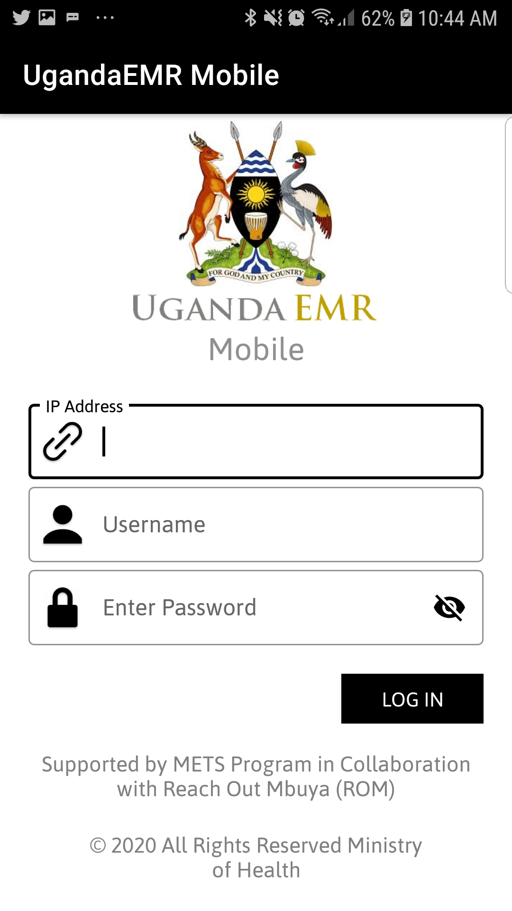
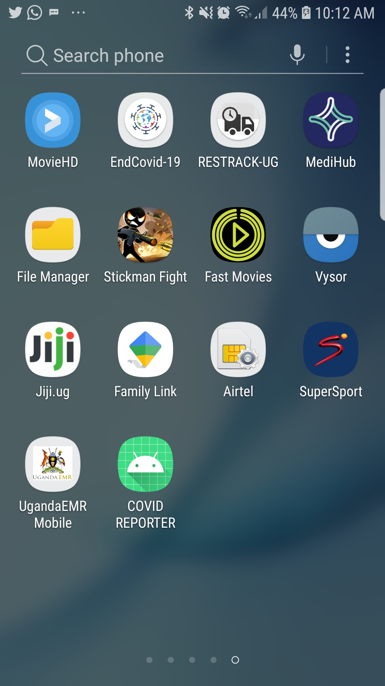
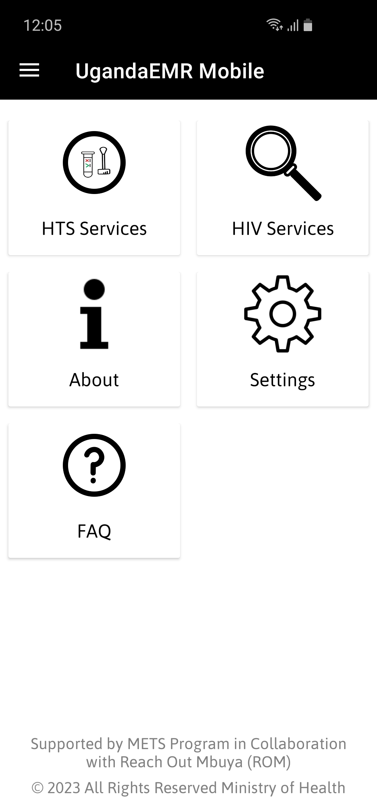

# Introduction

## UgandaEMR Mobile User Manual

This document describes how to use the UgandaEMR Mobile as an extension of UgandaEMR.

The supported implementations include:
 
1 .  [HIV Services](download-patients.md)

2 . [HTS Services](hts-services.md)

## Download UgandaEMR Mobile

1 . To download UgandaEMR Mobile, visit the link https://play.google.com/store/apps/details?id=org.ugandaemr.mobile OR:   Go to google play store and search UgandaEMR Mobile

2 .  Click the install button to install UgandaEMR Mobile

## Login

1. Launch UgandaEMR Mobile app on the Phone or Tablet. 
Tap on the icon for UgandaEMR Mobile as shown in the figure below.
 
2. Enter IP address, username and password to login 
3. Click on login. This will navigate you to the home screen. 

## Uninstalling UgandaEMR Mobile

Below is the process to uninstalling UgandaEMR mobile appp from the device:

1. Long Press on the icon for UgandaEMR Mobile as shown in the figure below. From the popup Tap on Uninstall to remove the app from the device.
   

