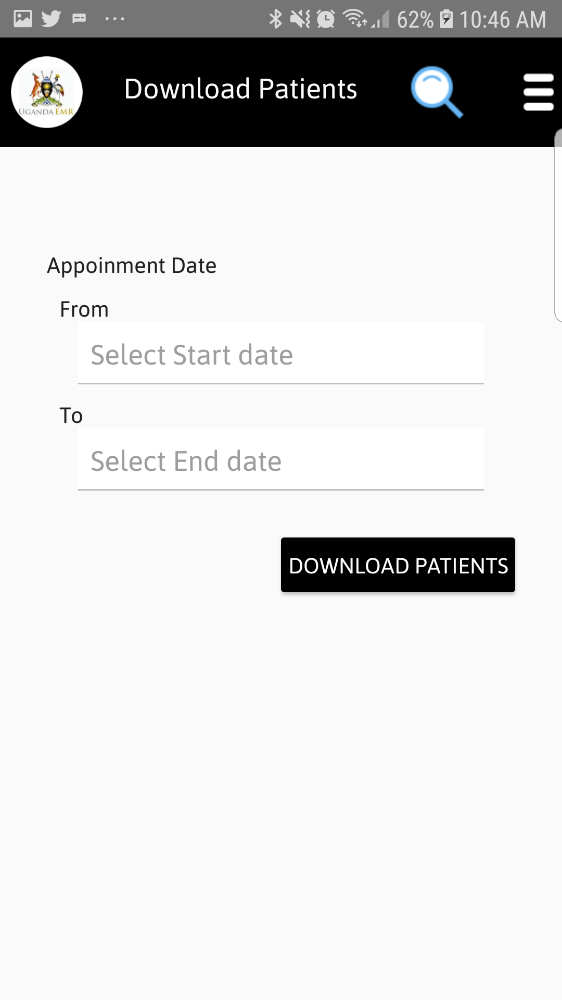

## Downloading Patient In UgandaEMR Mobile
1. To Download Patients Tap Download Patient on the menu screen.
2. Select Appointment Start and End Dates for patients with appointments to download, after Tap on the Download Patient Button as shown in the figure below. 
3. After downloading patients a dialog will popup as shown in the figure below, Click the FIND PATIENT button.
      
## Find Patients In UgandaEMR Mobile
1. On the menu screen Tap Find Patient, a screen below will be seen.
   Enter appointment date or vist date, Patient Name or ART Number and Tap search button to assess the patient. 
   
2. Once the  patient is found, a pop up with the patient name appears as shown in the image below . 

## Work Summary
1. To assess a patient in UgandaEMR mobile app Tap Work Summary from the menu screen or home screen, Select visit date for patients with appointments. use the filter to navigate through different options.
2. On selecting the visit date, a list of downloaded patients will be displayed.
3. To assess a patient Tap Assess Patient to start an assessment as shown 

 **NOTE:** 
   If the patient is  represented Tap Yes button and Dispense drugs to the Patient otherwise click YES to start the assessment.
   start assessing the patient. 
## Drug Dispensing 
1. Tap on the drug or combination from the Drug administration tables as shown below to enter pills dispensed and duration in days. 
  
2. To administer other drugs besides the current regimen  Tap on the ADD OTHER DRUG button, enter drug name, dose and duration as shown below. 
  
3. Tap Continue Button to proceed and enter the patient next appointment date and finalize the assessment by setting the Next Appointment Date

