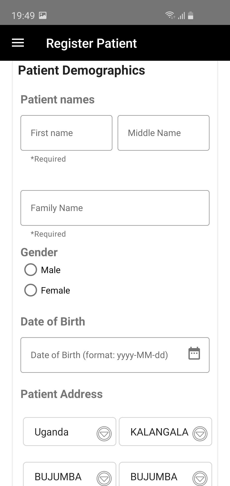
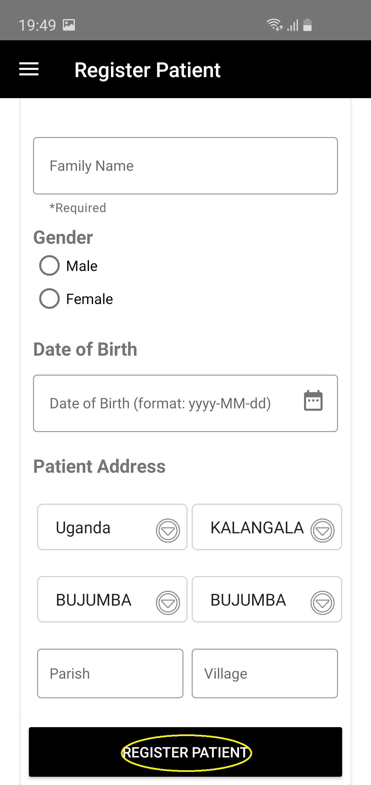
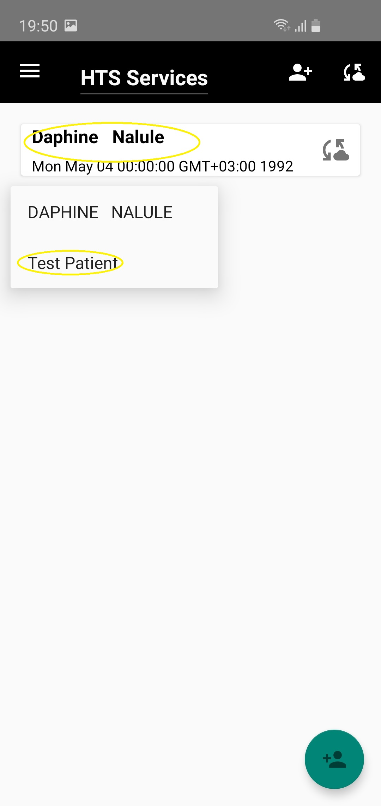
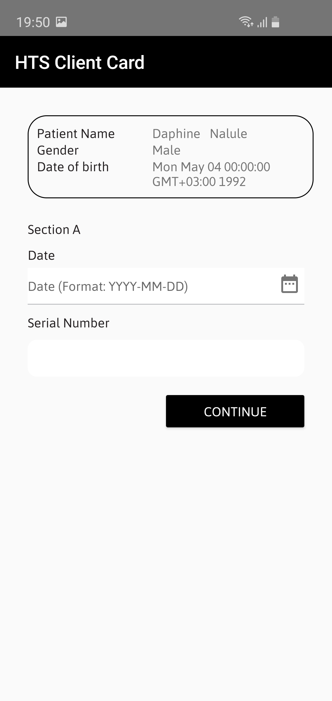
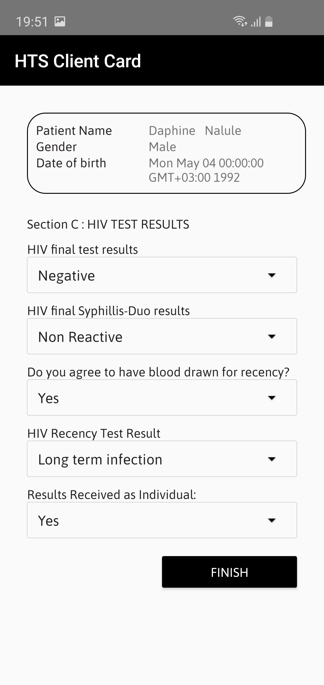
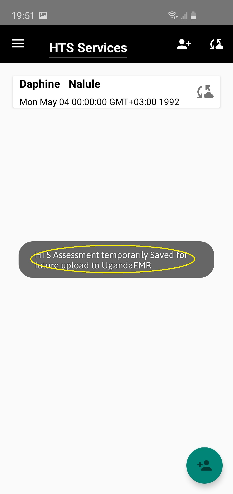
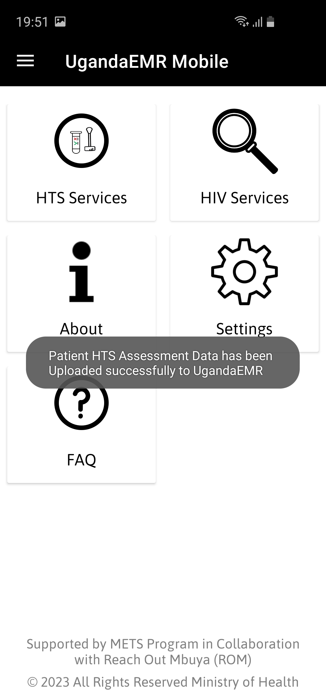
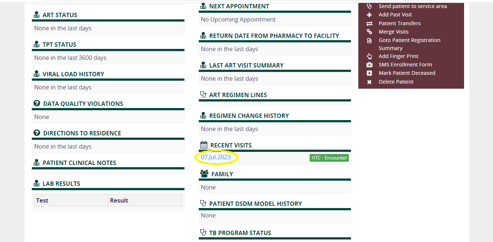

## HTS Services

# Registering a patient

1 . To register a patient, tap on the add patient icon at the bottom of the screen in Green or the second icon in the 
top left corner in white.

2 . Enter patient demographics as shwon in the image below
    
    
3 . Tap register patient at the end of the screen once your done entering all patient demographics.
    

4 . To test the patient, tap on the patient's name and this will bring up a pop up menu
 from which your to choose test patient.
    
    
5 . This will open the HTS Client Card in three subsections (Section A, Section B, and Section C). To move to the next
 section, tap Continue.
    
 
 6 . To save the details entered in the HTS Client Card, tap Finish.
    
    
7 . Once saved successfully, the following message will appear on your screen.
    
    
# Sync Patient Data

1 . Once your done testing all patients, tap on the sync patient icon at the top left of your screen. 
    
    
2 . Once Patient Identification is completed successfully, patient HTS Assessment Data is uploaded to UgandaEMR.
    
    
3 . Back to UgandaEMR at the facility, the encounter should appear in the recent visits of the patient's dashboard.
    

