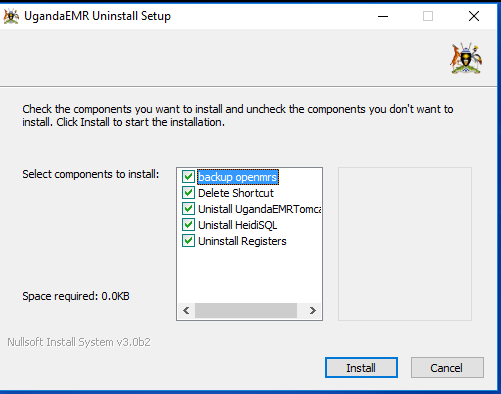

# Unistalling UgandaEMR older versions

To uninstall Uganda EMR,

1. Go to control panel, select unistall UgandaEMR 
2. You will be prompted to uninstall components

1. Go to control panel, uninstall Mysql and Java if you do not have any systems running with the 2 programs
2. UgandaEMR will be completely uninstalled.

