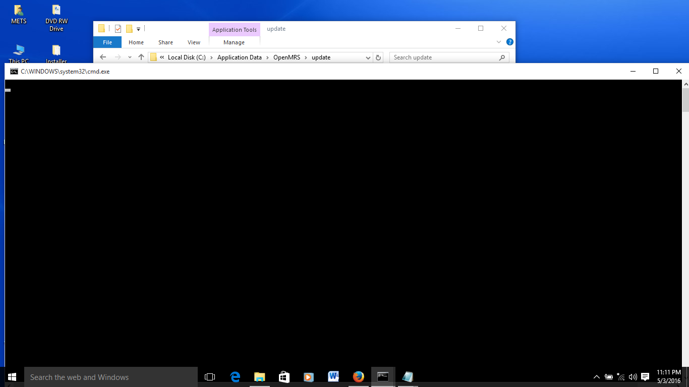
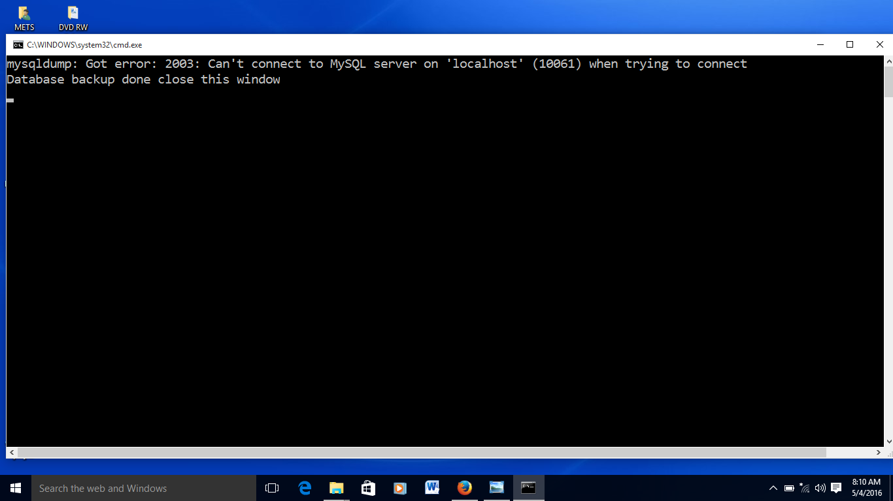
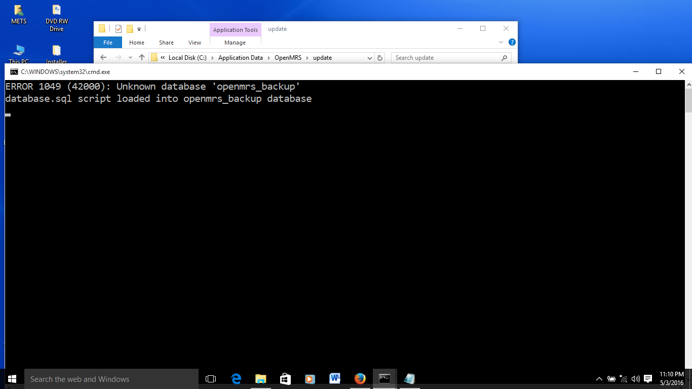
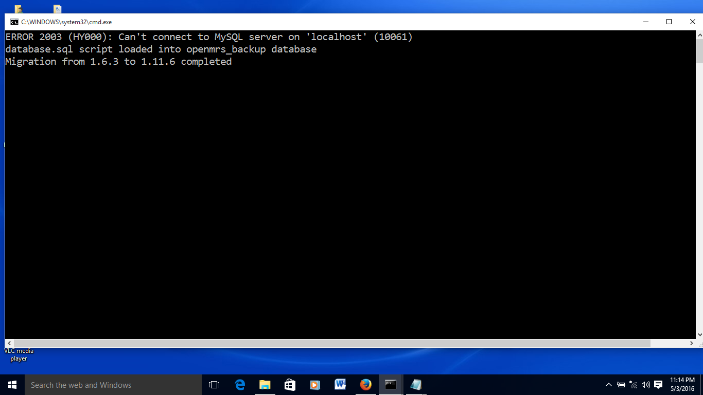
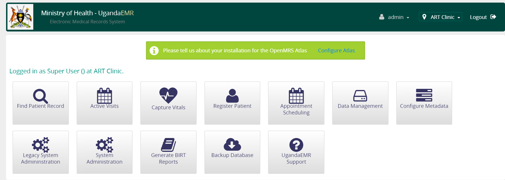
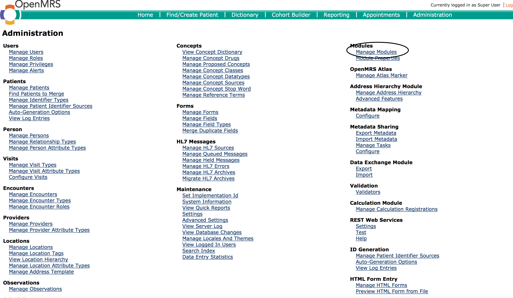
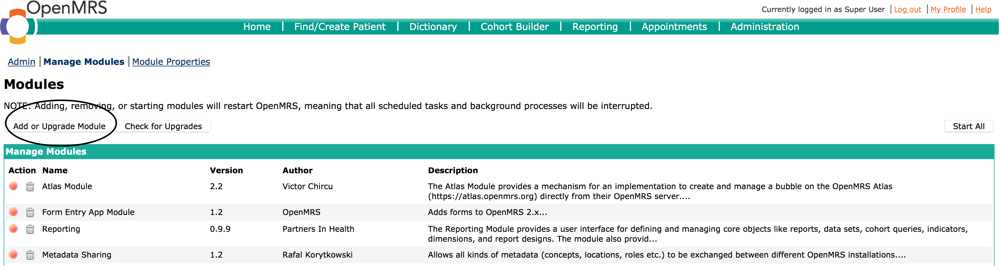
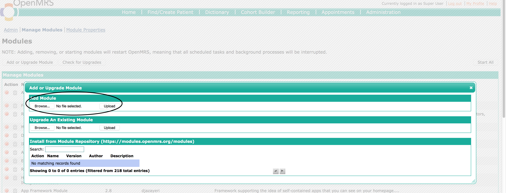
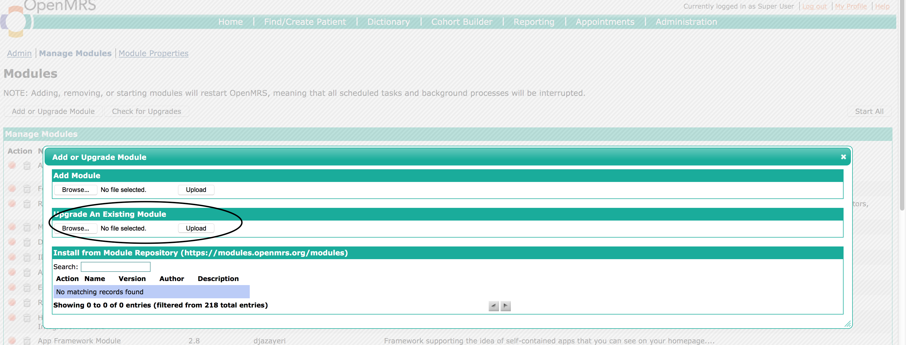
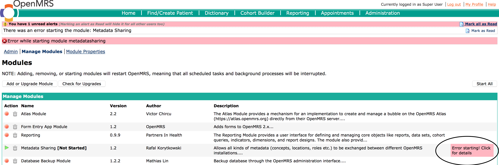

. # Upgrading UgandaEMR 
## Upgrading from OpenMRS 1.6.3
The upgrade from 1.6.3 to 1.11.6 involves running two steps:
1. Creating a backup file of the existing 1.6.3 installation 
2. Migrating the 1.6.3 database backup file 

All these steps are run from the upgrade folder which can be found at C:\Application Data\OpenMRS\upgrade like in the image below 

Due to the security restrictions, the files shall need to be run as administrator 
### 1.6.3 installed on same machine as 1.11.6 
In this scenario the 1.6.3 database is running on the same computer as the new 1.11.6 database 

1. Double click the backupdatabase file, and the window below will appear. 

2. Close the window to show the file manager, and a new file database (or database.sql) will be shown.

3. This file should have a size greater than 0KB, which shows that the backup process was successful.
4. Double click the upgradedatabase file, and wait for some time as a black window is displayed.   

### Database backup script available 
The backup file exists from another computer and is to be added to the upgrade folder

1. Copy the backup file to the upgrade folder
2. Rename the backup file to database (or datatabase.sql if the file extension is shown)
3. Double click the upgradedatabase file, and wait for some time as a black window is displayed.   

### Common Errors
#### backupdatabase has an access denied error

This is because the password for root has changed from a blank password
1. Open the backupdatabase (or backupdatabase.bat) file in Notepad and add the following to the line that starts with @mysqldump 
`@mysqldump -ppassword`  
password is the password of the root account, and there is no space after the -p
2. Doubleclick the backupdatabase file 

#### upgradedatabase has an error - openmrs_backup database not found
This is because the installer did not create the openmrs_backup database. Uninstall UgandaEMR and start again

#### upgradedatabase has an error 2003 - Can't connect to MySQL server on local host (10061)

This is because the password for root has changed from a blank password
1. Open the upgradedatabase (or upgradedatabase.bat) file in Notepad and add the following to the line that starts with @mysqldump 
`@mysql -ppassword`  
password is the password of the root account, and there is no space after the -p
2. Doubleclick the upgradedatabase file

## Upgrading from OpenMRS 1.9.x
The upgrade from 1.9.x requires the replacement of the WAR file using the steps below:
1. Open 
## Adding a new module
A new module is usually added to provide new functionality and features that were not currently available. 
1. Login as a user with administration privileges
2. Click legacy administration link as circled in the image below

3. Select the Manage Modules link 

4. On the Manage modules page, click the Add/Upgrade module button

5. In the popup window use the browse button under Upgrade Existing module to select the module file from your computer, then click Upload

6. The module will be uploaded and started, which is seen by having a red button next to the name of the module 

## Upgrading a module
In this case the modules to be upgraded will be uploaded through the administration interface
1. Login as a user with administration privileges
2. Click legacy administration link as circled in the image below

3. Select the Manage Modules link 

4. On the Manage modules page, click the Add/Upgrade module button

5. In the popup window use the browse button under Upgrade Existing module to select the module file from your computer, then click Upload

6. The module will be uploaded and started, which is seen by having a red button next to the name of the module 

## Upgrading with a WAR file 
This will be done when there are multiple modules that need to be upgraded as a complete package, therefore a new WAR file is to be installed
1. Clean up the existing installation by: 
  * Delete the openmrs.war and openmrs folder in the directory C:\Program Files\UgandaEMR\apache-tomcat\webapps  
  * Delete all the modules in the directory C:\Application Data\OpenMRS\modules which is where any modules uploaded from the administration interface are stored. The modules in this directory override those added to the WAR file 
2. Copy the new WAR file to C:\Program Files\UgandaEMR\apache-tomcat\webapps  
3. Go to the UgandaEMR login link at http://localhost:8081/openmrs/ 

## Common Troubleshooting Tips
### Error starting uploaded module
This is usually characterized by a green arrow next to the module name, an error message at the top of the Manage Modules page and a text box in the row of the module name with the words "Error starting! Click here for details"

1. Click the text box to find out the details of why the module did not start:
  - If the error is caused by a missing module then upload the module following the steps above
  - If the error is caused by a higher version of a module, then upgrade the module to that higher version. Please note that this may cause additional errors in other modules that may be incompatible with the higher version.
  - If a lower version of a module is required, then you may need to upload a lower version of the module, though this may cause other modules to fail loading  
2.  Restart the computer which resets all UgandaEMR services.
