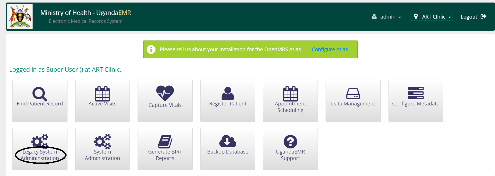

# Upgrading UgandaEMR 
## Upgrading from OpenMRS 1.6.3 with database backup file available
The upgrade from 1.6.3 to 1.11.6 involves running two batch 
### Common Errors
#### The port for 1.6.3 database is not 3307
#### The root password for 1.6.3 is not blank
#### The script to be used to upgrade is not called database.sql 
## Upgrading from OpenMRS 1.9.x
## Adding a new module
A new module is usually added to provide new functionality and features that were not currently available. 
1. Login as a user with administration privileges
2. Click legacy administration link as circled in the image below

3. Select the Manage Modules link 

4. On the Manage modules page, click the Add/Upgrade module button

5. In the popup window use the browse button under Upgrade Existing module to select the module file from your computer, then click Upload

6. The module will be uploaded and started, which is seen by having a red button next to the name of the module 

## Upgrading a module
In this case the modules to be upgraded will be uploaded through the administration interface
1. Login as a user with administration privileges
2. Click legacy administration link as circled in the image below

3. Select the Manage Modules link 

4. On the Manage modules page, click the Add/Upgrade module button

5. In the popup window use the browse button under Upgrade Existing module to select the module file from your computer, then click Upload

6. The module will be uploaded and started, which is seen by having a red button next to the name of the module 

## Upgrading with a WAR file 
This will be done when there are multiple modules that need to be upgraded as a complete package, therefore a new WAR file is to be installed
1. Clean up the existing installation by: 
  * Delete the openmrs.war and openmrs folder in the directory C:\Program Files\UgandaEMR\apache-tomcat\webapps  
  * Delete all the modules in the directory C:\Application Data\OpenMRS\modules which is where any modules uploaded from the administration interface are stored. The modules in this directory override those added to the WAR file 
2. Copy the new WAR file to C:\Program Files\UgandaEMR\apache-tomcat\webapps  
3. Go to the UgandaEMR login link at http://localhost:8081/openmrs/ 

## Common Troubleshooting Tips
### Error starting uploaded module
This is usually characterized by a green arrow next to the module name, an error message at the top of the Manage Modules page and a text box in the row of the module name with the words "Error starting! Click here for details"

1. Click the text box to find out the details of why the module did not start:
  - If the error is caused by a missing module then upload the module following the steps above
  - If the error is caused by a higher version of a module, then upgrade the module to that higher version. Please note that this may cause additional errors in other modules that may be incompatible with the higher version.
  - If a lower version of a module is required, then you may need to upload a lower version of the module, though this may cause other modules to fail loading  
2.  Restart the computer which resets all UgandaEMR services.
