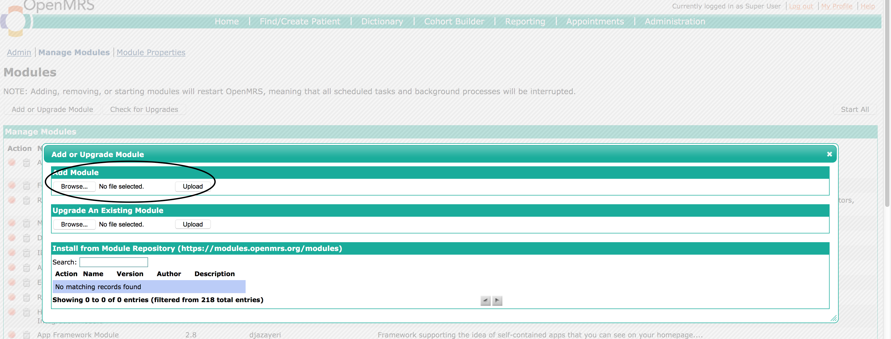

# Upgrading UgandaEMR

The upgrade process from 1.x to 2.x is no longer supported as of January 2021, as the majority of installations have migrated to the new 2.x or 3.x series

The upgrade across 2.x and 3.x versions is done by deploying a new WAR file 

## Using a WAR file

There are two approaches

1. Inbuilt Command Menu
2. Manual Replacement of WAR file 

### Using Windows Command Menu
TBD: Add Screenshots to illustrate the menus 
1. Goto  Start Menu  Select All Programs \(Windows 7\) or All apps \(Windows 10\).
2. Select UgandaEMR then select Upgrade UgandaEMR War File.
3. This will popup a window. in it select install.
4. Browse to the location of the war file. then upgrade and click open.
5. When upgrade is complete it will give you a message to proceed to browser.

### Manual Replacement of WAR file

TBD

## Adding/Upgrading Modules
This section provides steps to add and/or upgrade a single module

### Adding a new module

A new module is usually added to provide new functionality and features that were not currently available.
1. Login as a user with administration privileges
2. Click legacy administration link as circled in the image below  
   
3. Select the Manage Modules link  
   
4. On the Manage modules page, click the Add/Upgrade module button  
   
5. In the popup window use the browse button under Upgrade Existing module to select the module file from your computer, then click Upload  
   
6. The module will be uploaded and started, which is seen by having a red button next to the name of the module

### Upgrading a module

In this case the modules to be upgraded will be uploaded through the administration interface
1. Login as a user with administration privileges
2. Click legacy administration link as circled in the image below  
   
3. Select the Manage Modules link  
   
4. On the Manage modules page, click the Add/Upgrade module button  
   
5. In the popup window use the browse button under Upgrade Existing module to select the module file from your computer, then click Upload
6.The module will be uploaded and started, which is seen by having a red button next to the name of the module