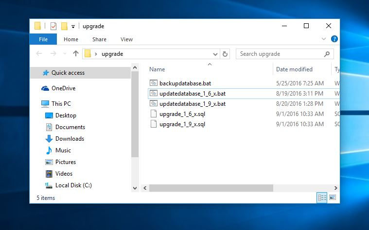
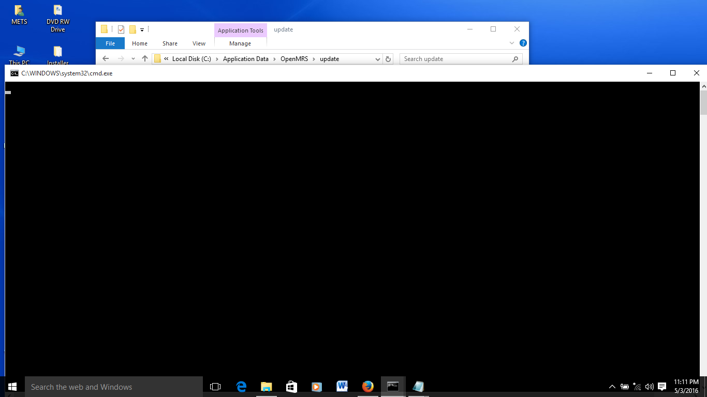
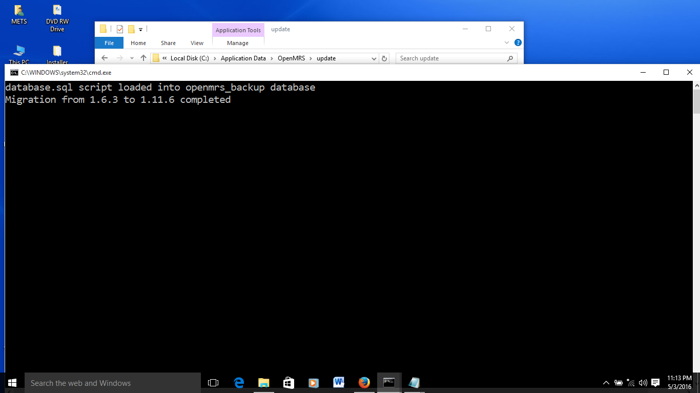

# Upgrading from 1.6.x ,1.9.x to 1.11.x

The upgrade from 1.6.x,1.9.x to 1.11.6 involves running two steps:

1. Creating a backup file of the existing 1.6.3 installation
2. Migrating the 1.6.x,1.9.x database backup file 

All these steps are run from the upgrade folder which can be found at C:\Application Data\OpenMRS\upgrade like in the image below

Due to the security restrictions, the files shall need to be run as administrator

### 1.6.x,1.9.x installed on same machine as 1.11.6

In this scenario the 1.6.x database is running on the same computer as the new 1.11.6 database.  
NB for 1.9.x first run the backup script before installing UgandaEMR.

1. Double click the backupdatabase file, and the window below will appear. 

   

2. Close the window to show the file manager, and a new file database \(or database.sql\) will be shown.

   

3. This file should have a size greater than 0 sKB, which shows that the backup process was successful.
4. Double click on the updatedatabase\_1\_6\_x.bat or updatedatabase\_1\_9\_x.bat depending on which version of OpenMRSyou are migrating from, and wait for some time as a black window is displayed.   

   

### Database backup script available

The backup file exists from another computer and is to be added to the upgrade folder

1. Copy the backup file to the upgrade folder
2. Rename the backup file to database \(or datatabase.sql if the file extension is shown\)
3. Double click the upgraded database file, and wait for some time as a black window is displayed.   

   

## **Upgrading from 1.11.x to 2.0.x**

1. Download an upgrade file from [http://emrportal.mets.or.ug/downloads](http://emrportal.mets.or.ug/downloads) called UgandaEMRUpgrade2\_0
2. Download the UgandaEMR 2.0 war File from [http://emrportal.mets.or.ug/downloads](http://emrportal.mets.or.ug/downloads)
3. Run the downloaded file and click install. This will prompt a popup installer with install which will run some background tasks then prompt you to browse to a war file
4. select the war file you have just download. and select okay. This will upload the war file in the tomcat server
5. Click okay to complete the process
6. Launch Browser with UgandaEMR at [http://localhost:8081/openmrs](http://localhost:8081/openmrs) a setup screen will show asking you for your current username and password
7. enter username and password and click on the green button.
8. Scroll down and press on the green button below the page. then wait login screen to appears.

