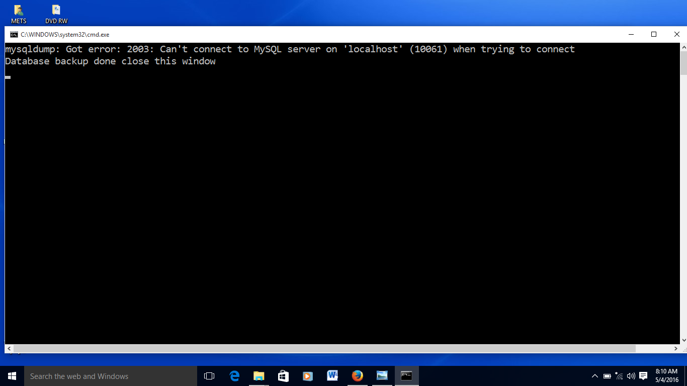
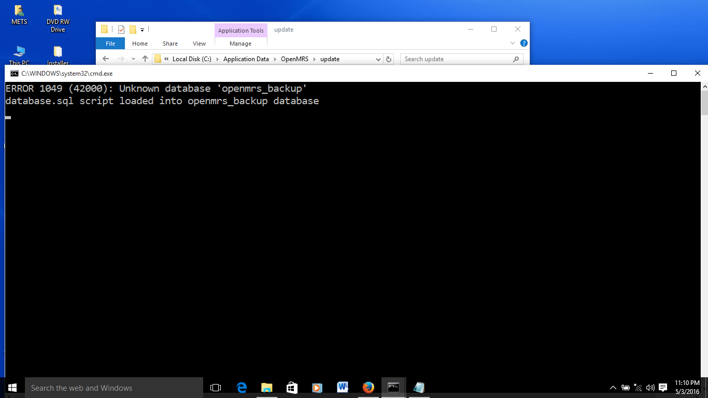
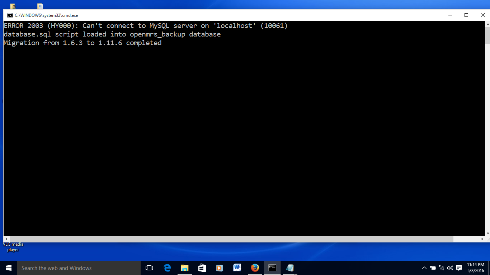
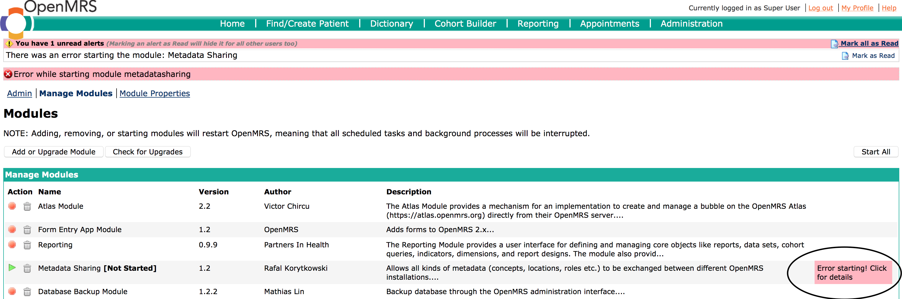
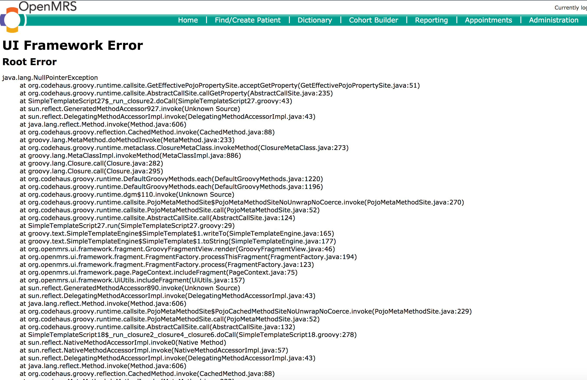
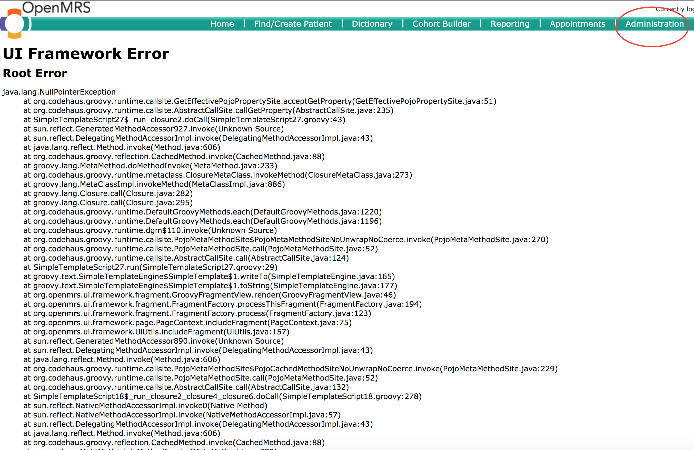
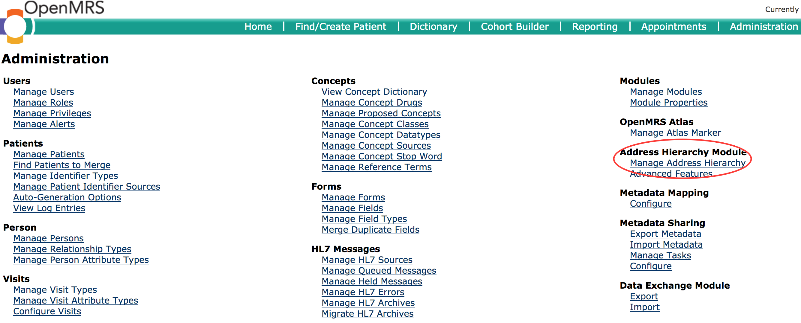

# Trouble Shooting

## backupdatabase script has an access denied error

  
This is because the password for root has changed from a blank password

1.Open the backup database \(or backupdatabase.bat\) file in Notepad and add the following to the line that starts with @mysqldump

`@mysqldump -ppassword`

password is the password of the root account, and there is no space after the -p

2.Doubleclick the backupdatabase file

## upgradedatabase script has an error - openmrs\_backup database not found

This is because the installer did not create the openmrs\_backup database. Uninstall UgandaEMR and start again

## upgradedatabase script error 2003 - Can't connect to MySQL server on local host \(10061\)

  
This is because the password for root has changed from a blank password

1.Open the upgradedatabase \(or upgradedatabase.bat\) file in Notepad and add the following to the line that starts with @mysqldump

`@mysql -ppassword`  
password is the password of the root account, and there is no space after the -p

2.Doubleclick the upgradedatabase file

## Upgrade failed so need to reset environment

In case your upgrade fails, there is a need to restore the environment so that you can try again.

The steps are as follows:

1. Backup the openmrs database 
2. Delete the openmrs and openmrs\_backup databases
3. Create a new openmrs and openmrs\_backup databases
4. On the openmrs database run the following scripts:
   * new-install.sql - this one creates a blank database for UgandaEMR 
   * concept\_dictionary script - use the latest version  
5. Restart your computer so that UgandaEMR can start
6. Run the upgrade again

## Error starting uploaded module

This is usually characterized by a green arrow next to the module name, an error message at the top of the Manage Modules page and a text box in the row of the module name with the words "Error starting! Click here for details"  
  
1.Click the text box to find out the details of why the module did not start:

* If the error is caused by a missing module then upload the module following the steps above
* If the error is caused by a higher version of a module, then upgrade the module to that higher version. Please note that this may cause additional errors in other modules that may be incompatible with the higher version.
* If a lower version of a module is required, then you may need to upload a lower version of the module, though this may cause other modules to fail loading

2.Restart the computer which resets all UgandaEMR services.

## UI Framework Error: Null Pointer Exception on Patient Registration

A common cause is blank entries in the address hierarchy during the upgrade process as seen in the link below  

1. Click the Administration link in the top menu as below:

   

2. Click the Manage Address Hierarchy link on the administration dashboard

   

3. Delete all the address hierarchy entries in the rectangle which are causing the error one level at a time 

   

## Address hierarchy is not installed properly with missing entries and unable to delete any levels

This happens in case there is an error when loading the entries for the address hierarchy see screenshot below

The fix is by deleting the current address hierarchy entries, then restarting your computer so that it is loaded properly.

1. Backup your database 
2. Run the SQL commands below:

   /_!40101 SET @OLD\_CHARACTER\_SET\_CLIENT = @@CHARACTER\_SET\_CLIENT_ /;  
   /_!40101 SET @OLD\_CHARACTER\_SET\_RESULTS = @@CHARACTER\_SET\_RESULTS_ /;  
   /_!40101 SET @OLD\_COLLATION\_CONNECTION = @@COLLATION\_CONNECTION_ /;  
   /_!40101 SET NAMES utf8_ /;  
   /_!40103 SET @OLD\_TIME\_ZONE = @@TIME\_ZONE_ /;  
   /_!40103 SET TIME\_ZONE = '+00:00'_ /;  
   /_!40014 SET @OLD\_UNIQUE\_CHECKS = @@UNIQUE\_CHECKS, UNIQUE\_CHECKS = 0_ /;  
   /_!40014 SET @OLD\_FOREIGN\_KEY\_CHECKS = @@FOREIGN\_KEY\_CHECKS, FOREIGN\_KEY\_CHECKS = 0_ /;  
   /_!40101 SET @OLD\_SQL\_MODE = @@SQL\_MODE, SQL\_MODE = 'NO\_AUTO\_VALUE\_ON\_ZERO'_ /;  
   /_!40111 SET @OLD\_SQL\_NOTES = @@SQL\_NOTES, SQL\_NOTES = 0_ /;

   / _The address hierarchy may be installed before so this causes problems - remove instal trail of the address hierarchy_ /  
   DELETE FROM global\_property  
   WHERE property IN  
   \('address.format', 'addresshierarchy.database\_version', 'addresshierarchy.mandatory', 'addresshierarchy.started', 'metadatadeploy.bundle.version.org.openmrs.module.aijar.api.deploy.bundle.UgandaAddressMetadataBundle'\);

   / _Drop the address hierarchy tables if necessary_ /  
   ALTER TABLE address\_hierarchy\_address\_to\_entry\_map DROP FOREIGN KEY address\_id\_to\_person\_address\_table;  
   ALTER TABLE address\_hierarchy\_address\_to\_entry\_map DROP FOREIGN KEY entry\_id\_to\_address\_hierarchy\_table;  
   ALTER TABLE address\_hierarchy\_entry DROP FOREIGN KEY level\_to\_level;  
   ALTER TABLE address\_hierarchy\_entry DROP FOREIGN KEY `parent-to-parent`;  
   ALTER TABLE address\_hierarchy\_level DROP FOREIGN KEY parent\_level;  
   DROP TABLE IF EXISTS address\_hierarchy\_address\_to\_entry\_map;  
   DROP TABLE IF EXISTS address\_hierarchy\_entry;  
   DROP TABLE IF EXISTS address\_hierarchy\_level;

   /_!40101 SET SQL\_MODE = @OLD\_SQL\_MODE_ /;  
   /_!40014 SET FOREIGN\_KEY\_CHECKS = @OLD\_FOREIGN\_KEY\_CHECKS_ /;  
   /_!40014 SET UNIQUE\_CHECKS = @OLD\_UNIQUE\_CHECKS_ /;  
   /_!40101 SET CHARACTER\_SET\_CLIENT = @OLD\_CHARACTER\_SET\_CLIENT_ /;  
   /_!40101 SET CHARACTER\_SET\_RESULTS = @OLD\_CHARACTER\_SET\_RESULTS_ /;  
   /_!40101 SET COLLATION\_CONNECTION = @OLD\_COLLATION\_CONNECTION_ /;  
   /_!40111 SET SQL\_NOTES = @OLD\_SQL\_NOTES_ /;

3. Restart your computer

## Error starting Data Integrity Module

This error tends to happen from UgandaEMR 1.0.16 that requires this module to be available, which is based on upgrades from old versions of OpenMRS that had the data integrity module installed. The old version of a module left a dataintegrity tables installed, so the new version cannot replace some tables.

The fix involves deleting the dataintegrity\_rule table using different tools:

1. Command line

   * Connect to the database using the command 

   `mysql -u openmrs -p` which will request for a password

   * Change to the openmrs database 

   `use openmrs`

   * Delete the dataintegrity tables - not all of these may exist in your installation 

   `DROP TABLE IF EXISTS dataintegrity_run;`  
   `DROP TABLE IF EXISTS dataintegrity_result;`  
   `DROP TABLE IF EXISTS dataintegrity_column;`  
   `DROP TABLE IF EXISTS dataintegrity_check;`  
   `DROP TABLE IF EXISTS dataintegrity_integrity_checks;`  
   `DROP TABLE IF EXISTS dataintegrity_result;`  
   `DROP TABLE IF EXISTS dataintegrity_rule;`

   * Delete previous liquibase change logs for data integrity

   `DELETE FROM liquibasechangelog WHERE ID LIKE '%data-integrity%';`

   * Restart your computer 

2. Heidi SQL
   * Download the upgrade script from [https://sourceforge.net/projects/ugandaemr/files/1.0.16/dataintegritymodule\_cleanup-1.0.16.sql/download](https://sourceforge.net/projects/ugandaemr/files/1.0.16/dataintegritymodule_cleanup-1.0.16.sql/download)
   * Open a connection to the openmrs database on port 3306
   * Open File -&gt; Load SQL File and load the downloaded file 

## Mysql cannot start after 2.0 upgrade or installation

1. Go to start menu, search for services.
2. Under Services look for mysql.
3. Stop mysql service
4. Go to C:\ProgramData\MySQL\MySQL Server 5.5\data
5. Delete the following files:
   * ib\_logfile0
   * ib\_logfile1
6. Restart mysql from services.

## Tomcat Failing to start after 2.0 upgrade or installation

1. Go to Menu search for Launch Tomcat Manager and clink on it
2. After check the notification area and right click on tomcat icon 
3. Select Configuretion and a popup window will show
4. Go to the Java Tab  and select Use default.
5. Incase there are some text in the Java Options:, remove them and click apply
6. Go back to General tab and click start, to start tomcat

