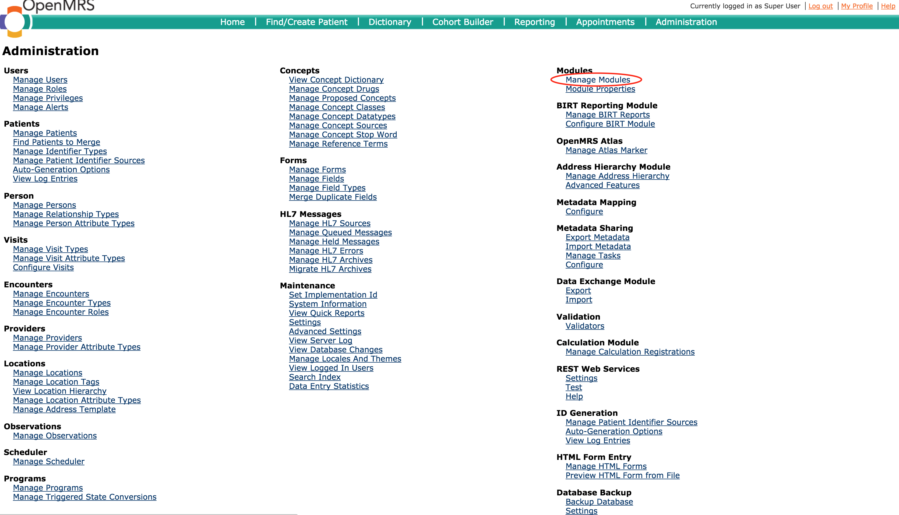
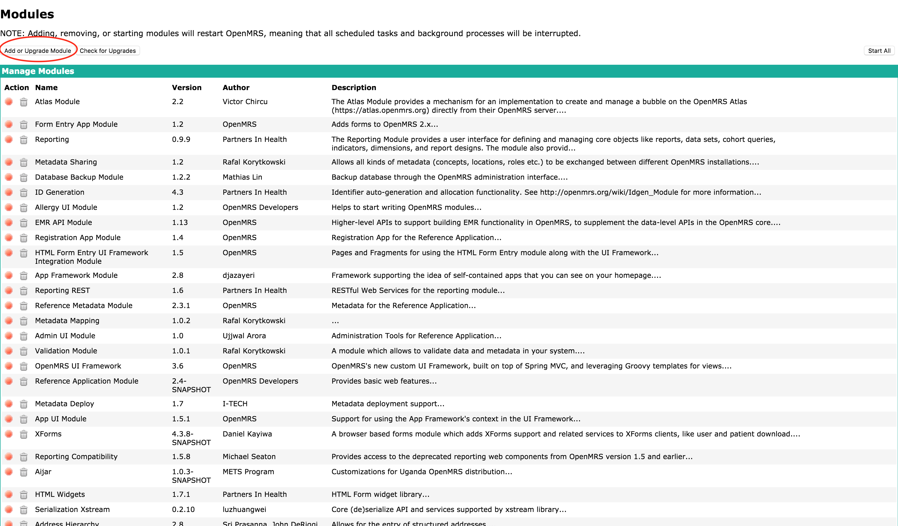
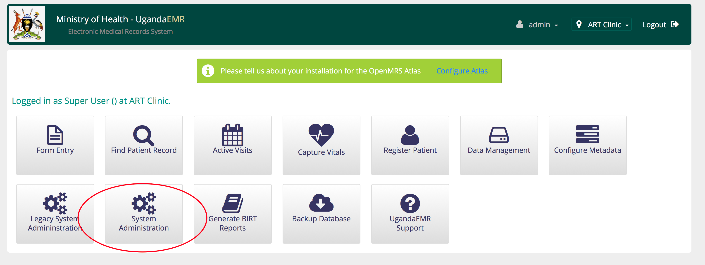
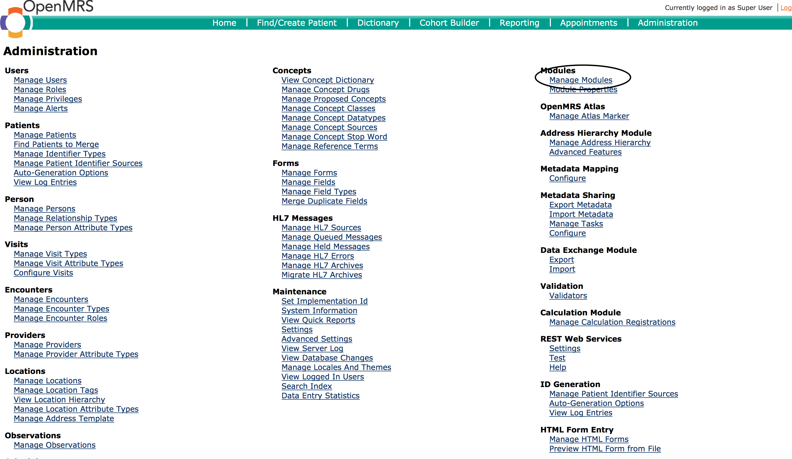
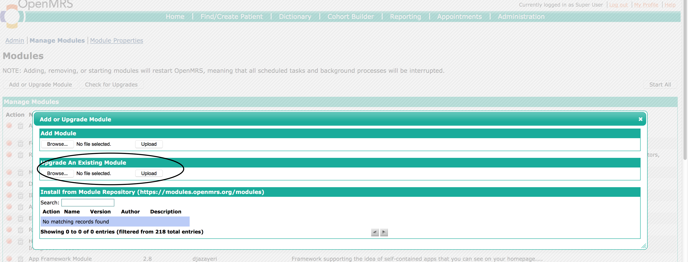

# Upgrading/Add Modules

## Adding a new module

A new module is usually added to provide new functionality and features that were not currently available.  
1. Login as a user with administration privileges  
2. Click legacy administration link as circled in the image below  
  
3. Select the Manage Modules link  
  
4. On the Manage modules page, click the Add/Upgrade module button  
  
5. In the popup window use the browse button under Upgrade Existing module to select the module file from your computer, then click Upload  
  
6. The module will be uploaded and started, which is seen by having a red button next to the name of the module

## Upgrading a module

In this case the modules to be upgraded will be uploaded through the administration interface  
1. Login as a user with administration privileges  
2. Click legacy administration link as circled in the image below  
  
3. Select the Manage Modules link  
  
4. On the Manage modules page, click the Add/Upgrade module button  
  
5. In the popup window use the browse button under Upgrade Existing module to select the module file from your computer, then click Upload

6.The module will be uploaded and started, which is seen by having a red button next to the name of the module

