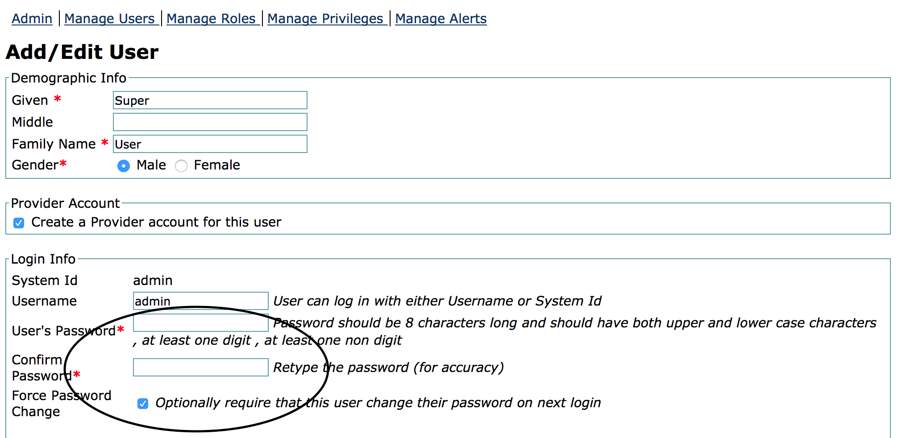
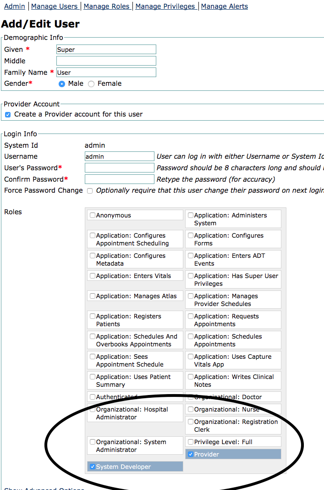

# Managing User Accounts

This section provides steps to create new user accounts, reset passwords and add/remove roles from the user

## Create a new user account

1. Login as a user with administrator privileges

   

2. Click legacy administration link as circled in the image below

   

3. Click on manage users link as shown below

   

4. Click on the Add User link as shown below

   

5. Click the button under the Create new person text

   

6. Enter the details for the user account, making sure to select the following:
    * The create provider account must option
    * Select the System Developer and Provider roles

## Reset user account password

1. Click legacy administration link as circled in the image below

   

2. Click on manage users link as shown below

   

3. Search for the user account to be updated then click the System Id of the user to edit

   

4. Enter the new password twice, and select the Force Password Change to ensure that the user changes their password at the next login

   

## Add a new role to a user account

1. Click legacy administration link as circled in the image below

   

2. Click on manage users link as shown below

   

3. Search for the user account to be updated then click the System Id of the user to edit

   

4. Select the roles for the new user account, current roles required are System Developer and Provider

   

