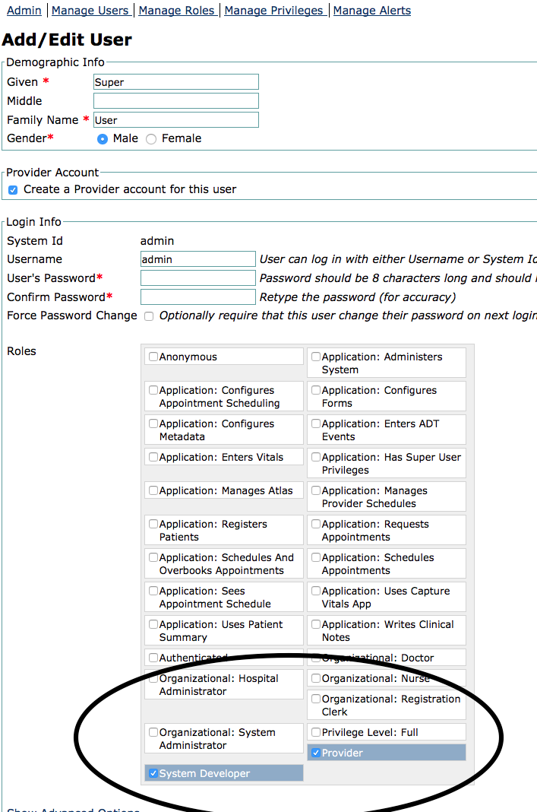

# Add a new role to a user account

1. Click legacy administration link as circled in the image below

   

2. Click on manage users link as shown below

   

3. Search for the user account to be updated then click the System Id of the user to edit

   

4. Select the roles for the new user account, current roles required are System Developer and Provider

   

