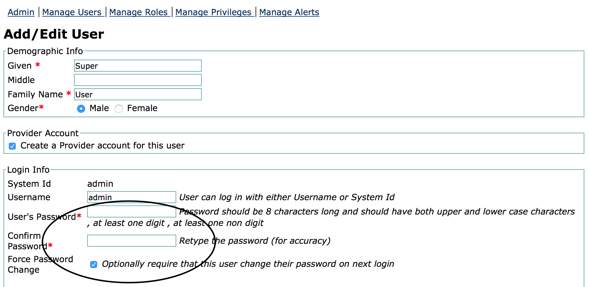

# Reset user account password

1. Click legacy administration link as circled in the image below

   

2. Click on manage users link as shown below

   

3. Search for the user account to be updated then click the System Id of the user to edit

   

4. Enter the new password twice, and select the Force Password Change to ensure that the user changes their password at the next login

   

